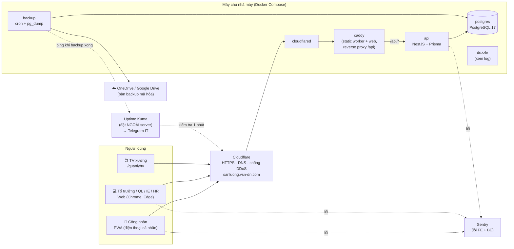
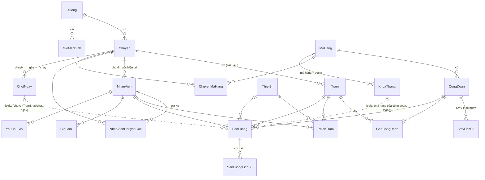
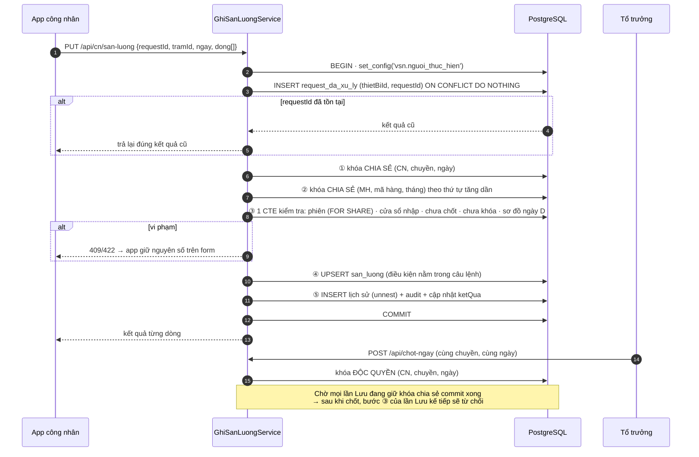
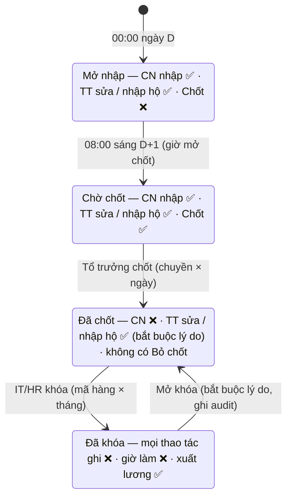
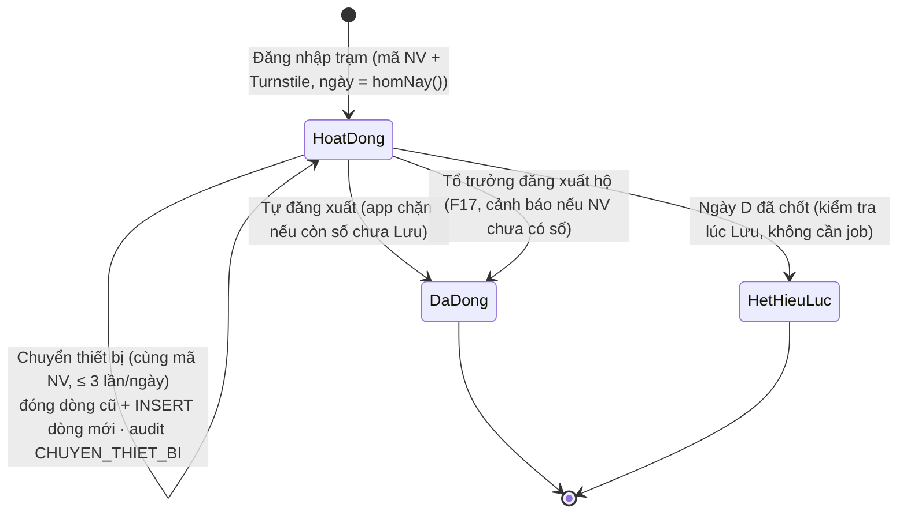

# TDD — VSN Sản Lượng

> **Phiên bản:** v1.1 · 01/10/2026 · Người phụ trách: Duy
> **v1.1:** cập nhật sau review kỹ thuật 01/10/2026 — 12 quyết định mới `[D16]`–`[D27]` (Phụ lục A), 4 diagram (mục 6.0, 8.9–8.11; bản draw.io ở `docs/diagrams/`).
> **Tài liệu gốc:** `PRD-VSN-SanLuong-v2.2.md`. PRD mô tả *làm gì*, TDD mô tả *làm thế nào*.
> **Khi mâu thuẫn:** PRD quyết định về nghiệp vụ, TDD quyết định về kỹ thuật. Mọi điểm lệch được ghi ở mục 21 và Phụ lục B.
> **Người đọc:** Duy, người IT thứ hai, AI coding tools (Claude Code, Codex).
> **Ký hiệu:** `[D x]` = quyết định kỹ thuật số x (Phụ lục A) · `[R x.y]` = mã quy tắc trong PRD · `[F x]` = tính năng trong PRD.

---

## Mục lục

1. Mục tiêu & nguyên tắc kiến trúc
2. Kiến trúc tổng thể
3. Môi trường & hạ tầng
4. Cấu trúc mã nguồn
5. Tech stack chi tiết
6. Dữ liệu
7. Thiết kế API
8. Luồng nghiệp vụ trọng yếu
9. Xác thực & phiên
10. Phân quyền
11. Ngày làm việc & thời gian
12. Audit log
13. Báo cáo & hiệu năng
14. Frontend
15. Tác vụ nền & backup
16. Kiểm thử
17. CI/CD & phát hành
18. Giám sát & vận hành
19. Checklist bảo mật
20. Lộ trình kỹ thuật MVP
21. Rủi ro kỹ thuật & việc còn mở
- Phụ lục A — Nhật ký quyết định
- Phụ lục B — Thay đổi đã áp dụng vào PRD (v2.1, v2.2)
- Phụ lục C — Nội dung `CLAUDE.md` gốc

---

## 1. Mục tiêu & nguyên tắc kiến trúc

**Mục tiêu kỹ thuật:** một người (Duy + AI tools) xây dựng và vận hành được hệ thống ghi sản lượng dùng để tính lương cho khoảng 450–525 công nhân, với dữ liệu **đúng, không mất, không bị sửa lén**, chi phí ≈ 0 đồng.

| # | Nguyên tắc | Vì sao | Thể hiện ở đâu |
|---|---|---|---|
| N1 | **Mỗi thứ chỉ có một nguồn sự thật** | Hai nguồn thì sớm muộn sẽ lệch, mà lệch số là lệch lương | Schema Zod trong `shared` `[D3]` · công thức trong view SQL `[D4]` · "hôm nay" chỉ do server tính `[D5]` |
| N2 | **Database là hàng rào cuối** | Code có bug hoặc AI viết sót thì DB vẫn chặn dữ liệu sai | Partial unique, CHECK, exclusion, trigger `[D4]` · điều kiện đặt trong câu lệnh ghi `[D7]` |
| N3 | **Mặc định từ chối** | Không thể "quên" kiểm tra quyền | Guard toàn cục + `@Quyen` + `PhamVi` bắt buộc `[D8]` |
| N4 | **Đơn giản trước, mở rộng khi đo thấy cần** | Ít thành phần thì ít chỗ hỏng, phù hợp khi vận hành một mình | Polling thay SSE `[D11]` · không hàng đợi · không bảng tổng hợp `[D10]` |
| N5 | **Dev và production chạy cùng một `docker compose`** | Chuyển máy hay rollback không phải cài lại từng thứ | `[D1]` `[D13]` |
| N6 | **Viết để AI đọc được** | AI làm việc chính xác khi ranh giới rõ và quy tắc được ghi thành văn bản | Monorepo `[D2]` · `CLAUDE.md` (Phụ lục C) · tên test mang mã `[R x.y]` `[D13]` |
| N7 | **Không bao giờ làm mất số của công nhân** | Công nhân mất số là mất niềm tin vào hệ thống | Form giữ số khi lỗi · `requestId` · `thuTuThietBi` so theo từng thiết bị `[D7]` `[D16]` · phiên đi theo người `[D21]` |

---

## 2. Kiến trúc tổng thể



### 2.1 Các container

| Container | Image | Cổng nội bộ | Mở ra ngoài | Volume | Ghi chú |
|---|---|---|---|---|---|
| `caddy` | `vsn-web:<tag>` (Caddy 2 + file build của `worker` và `web`) | 80 | Không (chỉ cloudflared gọi vào) | — | SPA fallback, header cache, proxy `/api` |
| `api` | `vsn-api:<tag>` (Node 24 LTS) | 4000 | Không | — | Chạy migration ở bước deploy, không chạy lúc khởi động · `mem_limit: 2g` `[D24]` |
| `postgres` | `postgres:17` | 5432 | Không (dev: chỉ `127.0.0.1:5432`) | `pgdata` | `TZ=Asia/Ho_Chi_Minh`, 3 tài khoản DB `[D9]` |
| `cloudflared` | `cloudflare/cloudflared` | — | Kết nối ra Cloudflare | — | Dùng `TUNNEL_TOKEN`, **tunnel riêng** cho sản lượng |
| `backup` | Tự build (alpine + `postgresql17-client` + `gnupg` + `rclone` + cron) | — | — | `backups` | Xem mục 15 |
| `dozzle` | `amir20/dozzle` | 8080 | **Chỉ bind `127.0.0.1`**, truy cập qua SSH tunnel | docker.sock | Xem log trên web · **bật xác thực**. ⚠ Mount `:ro` không giới hạn Docker API → coi như quyền root `[D24]` |

Mọi container đặt `restart: unless-stopped` (riêng `cloudflared` và `postgres` dùng `always`) cùng log driver `json-file` với `max-size: 20m`, `max-file: 5`.

### 2.2 Định tuyến theo đường dẫn `[D2]`

| Đường dẫn | Đích | Cache header (Caddy) |
|---|---|---|
| `/` và `/*` (trừ các nhánh dưới) | `worker/dist` · SPA fallback về `/index.html` | `index.html`, `sw.js`, `manifest.webmanifest`: `no-cache` |
| `/assets/*` (worker) | file có hash | `public, max-age=31536000, immutable` |
| `/quanly/*` | `web/dist` (build với `base: '/quanly/'`) · fallback `/quanly/index.html` | như trên |
| `/tv` | chuyển hướng 302 sang `/quanly/tv` | — |
| `/api/*` | `api:4000` | `no-store` (API tự đặt) |

> ⚠ **Bẫy service worker:** worker PWA có scope `/`, nên nếu không chặn thì nó sẽ can thiệp cả `/quanly` và `/api`. Bắt buộc cấu hình Workbox: `navigateFallbackDenylist: [/^\/quanly/, /^\/api/, /^\/tv/]` và **không** cache route `/api/*` (chiến lược NetworkOnly).
>
> ⚠ **Cloudflare cache:** tạo Cache Rule *Bypass* cho `/api/*`, `/sw.js`, `/index.html`, `/quanly/index.html`.

---

## 3. Môi trường & hạ tầng

### 3.1 Môi trường dev — laptop Windows 11 Home `[D1a]`

Hiện trạng (kiểm tra ngày 29/09/2026): i5-11300H · 24 GB RAM · WSL 2.7.10 · distro Ubuntu có sẵn · Node 24.18 · Git 2.55 · VS Code · cloudflared 2026.7.3. Cổng 3000 và 9248 đã bị app khác dùng.

**Checklist thiết lập (làm một lần):**

- [ ] Gỡ **Docker Desktop** (Settings → Apps), rồi `wsl --unregister docker-desktop`
- [ ] Chuyển Ubuntu sang ổ D: `wsl --shutdown` → `wsl --manage Ubuntu --move D:\WSL\Ubuntu`. Nếu lệnh không có thì dùng `wsl --export Ubuntu D:\WSL\ubuntu.tar` → `wsl --unregister Ubuntu` → `wsl --import Ubuntu D:\WSL\Ubuntu D:\WSL\ubuntu.tar`
- [ ] Tạo `%UserProfile%\.wslconfig`: `memory=12GB`, `processors=6`
- [ ] Trong Ubuntu: bật systemd (`/etc/wsl.conf` → `[boot] systemd=true`), cài **Docker Engine** từ apt repo chính thức của Docker, `sudo usermod -aG docker $USER`
- [ ] Cài Node 24 LTS bằng `fnm`, sau đó `corepack enable` để có `pnpm`
- [ ] VS Code: cài extension **WSL** và **Docker**, rồi mở dự án bằng `code ~/projects/vsn-sanluong`
- [ ] **Code đặt trong filesystem WSL** (`~/projects/...`), không đặt ở `D:\`, vì hot-reload qua ranh giới Windows ↔ WSL chậm 5–10 lần
- [ ] Cài `psql` (`postgresql-client`) và `k6` trong Ubuntu

**Cổng dev (tránh 3000):**

| Dịch vụ | Cổng |
|---|---|
| `web` (Vite) | 5173 |
| `worker` (Vite) | 5174 |
| `api` (NestJS watch) | 4000 |
| `postgres` | 5432 (chỉ `127.0.0.1`) |
| `caddy` (chạy thử bản production) | 8088 |

Khi dev: `docker compose up postgres` chạy DB trong Docker, còn `pnpm dev` chạy 3 app trực tiếp trong WSL để hot-reload nhanh. Trước mỗi lần deploy thì chạy thử **toàn bộ image production** bằng `docker compose -f compose.prod.yml up`.

### 3.2 Môi trường production — Windows Server `[D1b]` ⏳

Chưa chốt: cần chạy `D:\VSN-DN\_kiem-tra-may\CHAY-KIEM-TRA.cmd` trên server.

| Thứ tự ưu tiên | Điều kiện | Cấu hình |
|---|---|---|
| 1 | Server có Hyper-V (Windows Server Standard/Datacenter, CPU hỗ trợ ảo hóa) | VM **Ubuntu Server 24.04 LTS** · 4 vCPU · 8 GB RAM (cố định) · 120 GB · Automatic Start Action = Always start · checkpoint trước mỗi lần deploy lớn |
| 2 | Không có Hyper-V, Windows Server 2022+ | WSL2 + Docker Engine + Scheduled Task tự khởi động WSL lúc boot + `vmIdleTimeout=-1` |

Yêu cầu chung: UPS, đồng bộ NTP, Windows Update chỉ khởi động lại trong khung 23:00–05:00.

### 3.3 Cloudflare `[D1]` `[D6]`

- Tạo **tunnel mới** `vsn-sanluong` (tách khỏi tunnel đang có), chạy bằng token trong container.
- Public hostname `sanluong.vsn-dn.com` → `http://caddy:80`.
- SSL mode: Full. Bật "Always Use HTTPS".
- Cache Rules như mục 2.2.
- **Turnstile** (chế độ ẩn) cho `POST /api/cn/phien-tram`; API xác minh token qua `siteverify` `[D23]`.
- **Rate limiting rule** cho `/api/cn/phien-tram` theo IP với ngưỡng cao (chỉ chặn bot): công nhân dùng 4G, nhà mạng dùng CGNAT nên nhiều người dùng chung một IP `[D23]`.
- Caddy thêm header `X-Forwarded-For`. API **chỉ tin** `CF-Connecting-IP` khi request đi qua caddy (xem mục 9.4).

---

## 4. Cấu trúc mã nguồn `[D2]`

```
vsn-sanluong/                      # GitHub private repo
├── apps/
│   ├── api/                       # NestJS
│   │   ├── prisma/
│   │   │   ├── schema.prisma
│   │   │   ├── migrations/        # SQL do Prisma sinh + SQL tay (ràng buộc, trigger, view)
│   │   │   └── sql/               # Truy vấn báo cáo (TypedSQL)
│   │   ├── src/
│   │   │   ├── core/              # clock, prisma, audit-context, lỗi, guard quyền, pham-vi, logger
│   │   │   ├── modules/
│   │   │   │   ├── auth/          # phiên Web + TV
│   │   │   │   ├── thiet-bi/      # cookie thiết bị, phiên trạm
│   │   │   │   ├── danh-muc/      # xưởng, chuyền, trạm (F9), QR (F12)
│   │   │   │   ├── nhan-vien/     # F2
│   │   │   │   ├── ma-hang/       # mã hàng, công đoạn, lịch sử SMV (F3)
│   │   │   │   ├── so-do/         # gán công đoạn (F4)
│   │   │   │   ├── san-luong/     # GhiSanLuongService, form công nhân, Bảng sản lượng ngày (F1, F10, F19)
│   │   │   │   ├── gio-lam/       # F6
│   │   │   │   ├── chot-khoa/     # chốt ngày, khóa/mở khóa tháng (F10)
│   │   │   │   ├── bao-cao/       # F5, F11
│   │   │   │   ├── dashboard/     # F7
│   │   │   │   ├── xuat-luong/    # F15
│   │   │   │   ├── ke-hoach/      # F16
│   │   │   │   ├── tai-khoan/     # tài khoản, quyền vai trò (F8)
│   │   │   │   ├── cau-hinh/      # CauHinh
│   │   │   │   ├── import/        # khung import Excel dùng chung (xem trước → xác nhận)
│   │   │   │   ├── audit/         # xem audit log
│   │   │   │   └── health/
│   │   │   └── jobs/              # @nestjs/schedule
│   │   └── test/                  # test tích hợp (Testcontainers)
│   ├── worker/                    # PWA công nhân
│   └── web/                       # Web quản lý + TV (base /quanly/)
├── packages/
│   ├── shared/                    # schema Zod, kiểu, enum ChucNang, mã lỗi, công thức, ngày làm việc, format VN
│   └── ui/                        # token Tailwind + component dùng chung (từ ui-demo)
├── infra/
│   ├── caddy/Caddyfile
│   ├── backup/                    # Dockerfile, backup.sh, restore-test.sh
│   ├── compose.yml                # dev
│   ├── compose.prod.yml
│   └── deploy.sh
├── tools/
│   ├── seed-perf/                 # sinh 12 tháng dữ liệu giả
│   └── k6/                        # kịch bản tải
├── docs/                          # PRD, TDD, RUNBOOK, ADR
├── .github/workflows/             # ci.yml, release.yml
├── CLAUDE.md                      # quy ước cho AI (Phụ lục C)
└── pnpm-workspace.yaml
```

**Quy ước đặt tên:**

| Đối tượng | Quy ước | Ví dụ |
|---|---|---|
| Khái niệm nghiệp vụ | Tiếng Việt không dấu, camelCase, **đúng tên trong PRD ⑩** | `nhanVien`, `soLuong`, `ngayLamViec` |
| Khái niệm kỹ thuật | Tiếng Anh | `requestId`, `retry`, `cache` |
| Bảng / cột DB | snake_case qua `@@map` / `@map` | `san_luong.ngay_lam_viec` |
| File, thư mục | kebab-case | `ghi-san-luong.service.ts` |
| Mã lỗi | UPPER_SNAKE tiếng Việt không dấu | `NGAY_DA_CHOT` |
| Route API | kebab-case tiếng Việt | `/api/bang-san-luong` |

---

## 5. Tech stack chi tiết

| Lớp | Công nghệ | Ghi chú |
|---|---|---|
| Ngôn ngữ | TypeScript (`strict: true`) | Dùng chung ở mọi app |
| Runtime | Node.js 24 LTS | |
| Quản lý gói | pnpm workspaces | Không dùng Nx/Turborepo `[D2]` |
| Backend | NestJS | Module theo nghiệp vụ |
| Validation | Zod 4 + `nestjs-zod` | Nguồn duy nhất trong `shared` `[D3]` |
| ORM | Prisma (bản ổn định mới nhất lúc khởi tạo) | CRUD + migration. Báo cáo dùng TypedSQL, fallback `$queryRaw` + Zod parse `[D4]` |
| Database | PostgreSQL 17 + extension `btree_gist` | |
| Ngữ cảnh request | `nestjs-cls` (AsyncLocalStorage) | Mang `NguCanhAudit`, `PhamVi`, `traceId` |
| Log | `nestjs-pino` | JSON, có `traceId` `[D13]` |
| Tác vụ định kỳ | `@nestjs/schedule` | Chỉ việc nhẹ `[D11]` |
| Excel | ExcelJS (streaming `WorkbookWriter`) | `[D10]` |
| QR / PDF | `qrcode` + `pdfmake` | F12 |
| Băm mật khẩu | bcrypt (cost 12) | Theo PRD |
| Frontend | React 19 + Vite | 2 app: `worker`, `web` |
| Điều hướng | React Router v7 (library mode) | `[D12]` |
| Dữ liệu server | TanStack Query | Cache, polling `[D3]` `[D11]` |
| Form | React Hook Form + `zodResolver` | |
| Giao diện | **Tailwind CSS v3.4** + token của `ui-demo` + Radix UI | `[D12]` `[D14]`: v3.4 để hỗ trợ iOS Safari 15. Nâng lên v4 khi không còn máy iOS < 16.4 |
| Lưới dữ liệu | TanStack Table | Chỉ `web` |
| Kéo thả | dnd-kit | Chỉ `web` (F4) |
| Biểu đồ | Recharts | Chỉ `web`. Tắt animation ở TV `[D12]` |
| Icon / font | lucide-react · Be Vietnam Pro qua `@fontsource` (tự host, không phụ thuộc Google Fonts) | |
| Ngày giờ | date-fns v4 + `@date-fns/tz` | `[D5]` |
| PWA | `vite-plugin-pwa` (Workbox) | Dexie (IndexedDB) chỉ thêm ở F14 — giai đoạn 2 |
| Test | Vitest · Testcontainers · Playwright · k6 | `[D13]` |
| Reverse proxy | Caddy 2 | |
| Giám sát | Sentry (bản miễn phí) · Uptime Kuma · Dozzle | `[D13]` |
| CI/CD | GitHub Actions + GHCR (private) | `[D13]` |

---

## 6. Dữ liệu

### 6.0 ERD lõi nghiệp vụ `[D27]`

ERD 2 lớp: **(1) ERD lõi** dưới đây (vẽ tay, ít thay đổi; bản trình bày: `docs/diagrams/03-erd-loi.drawio`) · **(2) ERD đầy đủ** sinh tự động từ `schema.prisma` bằng `prisma-dbml-generator` trong CI (xem trên dbdiagram.io) — luôn khớp code, không cập nhật tay.



**Quy tắc snapshot (đường nét đứt = quan hệ logic, không join để lấy giá trị hiện tại):**

| Cần biết | Lấy từ | Không được |
|---|---|---|
| Chuyền của bản ghi sản lượng | `san_luong.chuyen_tram_snapshot` | Join `tram → chuyen` để lấy chuyền hiện tại |
| Chuyền gốc của NV tại ngày D | Hàm `chuyen_goc_ngay(nv, d)` đọc `nhan_vien_chuyen_goc` `[D18]` | Đọc `nhan_vien.chuyen_id` (chỉ là giá trị hiện tại) |
| SMV của bản ghi | `san_luong.smv_snapshot` (chỉ đổi qua luồng 8.6) | Join `smv_lich_su` lúc báo cáo |

### 6.1 Thay đổi so với mô hình dữ liệu PRD ⑩

Giữ nguyên toàn bộ bảng trong PRD ⑩, bổ sung và điều chỉnh như sau:

| Bảng | Thay đổi | Lý do |
|---|---|---|
| **`ThietBi`** (mới) | `id`, `tokenHash` (UNIQUE), `userAgent`, `taoLuc`, `lanCuoi` | Cookie thiết bị `[D6]`. **Chỉ tạo khi đăng nhập trạm thành công** `[D21]` |
| **`PhienDangNhap`** (mới) | `id`, `tokenHash` (UNIQUE), `taiKhoanId`, `loai` (WEB / TV), `taoLuc`, `lanCuoi`, `ip`, `userAgent` | Phiên Web/TV lưu ở server `[D6]` |
| **`RequestDaXuLy`** (mới) | PK **(`thietBiId`, `requestId`)** (Web: `taiKhoanId` thay cho `thietBiId`), `ketQua` (json, NULL khi đang xử lý), `luc` | Chống bấm Lưu nhiều lần `[D7]` `[D19]`. Dọn sau 7 ngày |
| **`NhanVienChuyenGoc`** (mới) | PK (`nhanVienId`, `tuNgay`), `chuyenId` | Lịch sử chuyền gốc theo ngày `[D18]`. **Ghi tự động** bằng trigger khi `nhan_vien.chuyen_id` đổi (`tuNgay = ngày làm việc lúc sửa`); không cho chọn lùi ngày |
| `Tram` | `chuyenId` **bất biến** (trigger chặn UPDATE) | Muốn chuyển thì ngưng trạm cũ, tạo trạm mới + in QR mới `[D17]` |
| **`ImportTam`** (mới) | `id`, `loai`, `nguoiTao`, `duLieu` (json), `hetHanLuc` | Import 2 bước: xem trước → xác nhận. Hết hạn sau 30 phút |
| `PhienTram` | Giữ `thietBiId` (FK → `ThietBi`); thêm `lyDoDong` (`TU_DANG_XUAT` / `DANG_XUAT_HO` / `CHUYEN_THIET_BI`) | Mỗi lần Lưu kiểm tra phiên theo thiết bị · chuyển thiết bị = đóng dòng cũ + INSERT dòng mới (giữ lịch sử) `[D21]` |
| `SanLuong` | Thêm `thuTuThietBi` (bigint), `thietBiId?`, `version` · **bỏ `chuyenGocNVSnapshot`** | Chống gói tin đến sai thứ tự `[D7]` · chuyền gốc lấy theo `NhanVienChuyenGoc` `[D18]` |
| `SanLuongLichSu` | Thêm `thietBiId?`, `requestId?` | Truy vết khi có khiếu nại |
| `AuditLog` | Thêm `loaiNguoiThucHien` (TAI_KHOAN / NHAN_VIEN / HE_THONG / DB_TRUC_TIEP), `thietBiId?`, `traceId` | `[D9]` |
| `TaiKhoan` | **Bỏ `tokenVersion`** | Thu hồi = xóa `PhienDangNhap` `[D6]` |

### 6.2 Quy ước Prisma

| Hạng mục | Quy ước |
|---|---|
| Khóa chính | UUID (ưu tiên UUID v7 nếu phiên bản Prisma hỗ trợ, để index chèn tuần tự) |
| Ngày làm việc | `DateTime @db.Date`. **Chỉ chuyển đổi sang chuỗi `YYYY-MM-DD` ở một chỗ** (Prisma client extension trong `core/prisma`) `[D5]` |
| Thời điểm | `DateTime @db.Timestamptz(3)` |
| Tên bảng/cột | camelCase trong Prisma, snake_case trong DB (`@@map`, `@map`) |
| Optimistic lock | `version Int @default(0)` trên bảng nghiệp vụ. Mọi UPDATE từ Web kèm `WHERE version = :expected` |
| Enum | Enum của PostgreSQL, khai báo trong Prisma, xuất lại trong `shared` |

### 6.3 Ràng buộc viết bằng SQL tay trong migration `[D4]`

```sql
CREATE EXTENSION IF NOT EXISTS btree_gist;

-- [R 1] Mỗi trạm × ngày chỉ 1 phiên đang hoạt động (chống 2 người đăng nhập cùng lúc, R 3.9)
CREATE UNIQUE INDEX ux_phien_tram_dang_hoat_dong
  ON phien_tram (tram_id, ngay_lam_viec) WHERE dang_xuat_luc IS NULL;

-- [R 1.3] Một thiết bị = một mã NV trong một ngày (được nhiều trạm)
ALTER TABLE phien_tram ADD CONSTRAINT ex_thiet_bi_mot_nv_mot_ngay
  EXCLUDE USING gist (thiet_bi_id WITH =, ngay_lam_viec WITH =, nhan_vien_id WITH <>)
  WHERE (dang_xuat_luc IS NULL);

-- [R 1.1] Key bản ghi sản lượng + số lượng hợp lệ
ALTER TABLE san_luong ADD CONSTRAINT ux_san_luong_key
  UNIQUE (ngay_lam_viec, tram_id, cong_doan_id, nhan_vien_id);
ALTER TABLE san_luong ADD CONSTRAINT ck_so_luong CHECK (so_luong BETWEEN 0 AND 99999);

-- F3: mỗi mã hàng tối đa 1 công đoạn hoàn thành (đủ 1 kiểm ở service khi lưu/import)
CREATE UNIQUE INDEX ux_cong_doan_hoan_thanh
  ON cong_doan (ma_hang_id) WHERE la_cong_doan_hoan_thanh;

-- [R 3.6] Lịch sử gán: cùng (trạm, công đoạn) không có 2 khoảng hiệu lực chồng nhau
ALTER TABLE gan_cong_doan ADD CONSTRAINT ex_gan_khong_chong
  EXCLUDE USING gist (tram_id WITH =, cong_doan_id WITH =,
                      tstzrange(hieu_luc_tu, hieu_luc_den) WITH &&);

-- F6
ALTER TABLE gio_lam    ADD CONSTRAINT ck_so_gio    CHECK (so_gio > 0 AND so_gio <= 16);
ALTER TABLE yeu_cau_gio ADD CONSTRAINT ck_so_gio_yc CHECK (so_gio > 0 AND so_gio <= 16);
CREATE UNIQUE INDEX ux_yeu_cau_gio_cho
  ON yeu_cau_gio (nhan_vien_id, ngay_lam_viec) WHERE trang_thai = 'CHO';

-- [D17] Trạm không bao giờ đổi chuyền
CREATE FUNCTION chan_doi_chuyen_tram() RETURNS trigger AS $$
BEGIN
  IF NEW.chuyen_id IS DISTINCT FROM OLD.chuyen_id THEN
    RAISE EXCEPTION 'TRAM_KHONG_DOI_CHUYEN';
  END IF; RETURN NEW;
END $$ LANGUAGE plpgsql;
CREATE TRIGGER tg_tram_chuyen_bat_bien BEFORE UPDATE OF chuyen_id ON tram
  FOR EACH ROW EXECUTE FUNCTION chan_doi_chuyen_tram();

-- [D18] Lịch sử chuyền gốc: tự ghi khi INSERT NV hoặc đổi chuyen_id (F2 và import đều đi qua đây)
--   tu_ngay = ngày làm việc hiện tại theo giờ VN; sửa nhiều lần trong ngày → lần cuối thắng
CREATE FUNCTION ghi_chuyen_goc() RETURNS trigger AS $$
BEGIN
  INSERT INTO nhan_vien_chuyen_goc (nhan_vien_id, tu_ngay, chuyen_id)
  VALUES (NEW.id, (now() AT TIME ZONE 'Asia/Ho_Chi_Minh')::date, NEW.chuyen_id)
  ON CONFLICT (nhan_vien_id, tu_ngay) DO UPDATE SET chuyen_id = EXCLUDED.chuyen_id;
  RETURN NEW;
END $$ LANGUAGE plpgsql;
CREATE TRIGGER tg_nv_chuyen_goc AFTER INSERT OR UPDATE OF chuyen_id ON nhan_vien
  FOR EACH ROW EXECUTE FUNCTION ghi_chuyen_goc();

-- F4: mỗi chuyền tối đa 2 mã hàng đang chạy → trigger BEFORE INSERT/UPDATE trên chuyen_ma_hang
--     đếm số dòng ket_thuc IS NULL của chuyen_id, > 2 thì RAISE EXCEPTION 'QUA_2_MA_HANG'

-- [D9] Bảng chỉ-thêm: AuditLog, SanLuongLichSu, LichSuXuatLuong
CREATE FUNCTION chan_sua_xoa() RETURNS trigger AS $$
BEGIN RAISE EXCEPTION 'Bảng % chỉ được thêm, không được sửa/xóa', TG_TABLE_NAME; END $$ LANGUAGE plpgsql;
CREATE TRIGGER tg_audit_chi_them BEFORE UPDATE OR DELETE ON audit_log
  FOR EACH ROW EXECUTE FUNCTION chan_sua_xoa();
CREATE TRIGGER tg_audit_khong_truncate BEFORE TRUNCATE ON audit_log
  FOR EACH STATEMENT EXECUTE FUNCTION chan_sua_xoa();
-- (tương tự cho san_luong_lich_su, lich_su_xuat_luong)
```

**Trigger "lưới an toàn"** trên `san_luong` và `gio_lam` `[D9]`: sau INSERT/UPDATE/DELETE, nếu `current_setting('vsn.nguoi_thuc_hien', true)` rỗng (tức là không đi qua ứng dụng) thì ghi 1 dòng `AuditLog` với `loaiNguoiThucHien = 'DB_TRUC_TIEP'` và `current_user`. Ứng dụng luôn chạy `SELECT set_config('vsn.nguoi_thuc_hien', <id>, true)` ở đầu mỗi transaction ghi (tham số `true` = chỉ có hiệu lực trong transaction; không dùng `SET LOCAL` vì lệnh `SET` không nhận tham số bind).

### 6.4 Tài khoản database `[D9]`

| Tài khoản | Quyền | Dùng cho |
|---|---|---|
| `vsn_app` | SELECT/INSERT/UPDATE/DELETE trên bảng nghiệp vụ · **chỉ INSERT/SELECT** trên `audit_log`, `san_luong_lich_su`, `lich_su_xuat_luong` · không có quyền DDL | API lúc chạy |
| `vsn_migrate` | Chủ sở hữu schema, có quyền DDL | Bước migrate trong `deploy.sh` |
| `vsn_backup` | Chỉ đọc | Container backup |
| `postgres` | Superuser | **Mật khẩu không lưu trên server**, cất trong két/sổ mật khẩu của IT |

### 6.5 Index `[D10]`

| Index | Phục vụ |
|---|---|
| `san_luong (ngay_lam_viec, chuyen_tram_snapshot)` | Báo cáo theo chuyền, Bảng sản lượng ngày, dashboard, F13 |
| `san_luong (nhan_vien_id, ngay_lam_viec)` | Báo cáo theo công nhân, F11 |
| `san_luong (cong_doan_id, ngay_lam_viec)` | Theo mã hàng, công đoạn nghẽn, tính lại SMV |
| `gan_cong_doan (tram_id, hieu_luc_tu, hieu_luc_den)` | Sơ đồ của ngày D |
| `phien_tram (thiet_bi_id, ngay_lam_viec)` | Danh sách phiên của điện thoại |
| `audit_log (luc DESC)`, `audit_log (doi_tuong, doi_tuong_id)` | Màn hình audit, lịch sử chỉnh sửa |
| `san_luong_lich_su (san_luong_id, luc_server)` | Lịch sử một ô |

### 6.6 View dùng chung — nguồn duy nhất của công thức `[D4]` `[D10]`

F5, F7, F11, F15 **bắt buộc** đọc qua 3 view này, không tự tính lại ở code.

```sql
CREATE FUNCTION loai_ngay(d date) RETURNS text IMMUTABLE LANGUAGE sql AS $$
  SELECT CASE EXTRACT(ISODOW FROM d) WHEN 6 THEN 'T7' WHEN 7 THEN 'CN' ELSE 'T2_T6' END $$;

-- Mức bản ghi: phút SMV từng dòng
CREATE VIEW v_san_luong_chi_tiet AS
SELECT sl.*, cd.ma_hang_id,
       sl.so_luong * sl.smv_snapshot / 60.0 AS phut_smv       -- NULL nếu công đoạn chưa có SMV
FROM san_luong sl JOIN cong_doan cd ON cd.id = sl.cong_doan_id;

-- [D18] Chuyền gốc của NV tại ngày D — nguồn duy nhất (view, phamViGioLam, báo cáo "Hỗ trợ từ chuyền X")
CREATE FUNCTION chuyen_goc_ngay(nv uuid, d date) RETURNS uuid STABLE LANGUAGE sql AS $$
  SELECT chuyen_id FROM nhan_vien_chuyen_goc
  WHERE nhan_vien_id = nv AND tu_ngay <= d ORDER BY tu_ngay DESC LIMIT 1 $$;

-- Mức NV × ngày: tổng phút SMV, giờ làm hiệu lực, % hiệu suất
CREATE VIEW v_nv_ngay AS
WITH sl AS (
  SELECT s.nhan_vien_id, s.ngay_lam_viec,
         SUM(s.so_luong)                                 AS tong_san_luong,
         SUM(s.so_luong * s.smv_snapshot) / 60.0         AS phut_smv,
         BOOL_OR(s.smv_snapshot IS NULL)                 AS thieu_smv,
         BOOL_OR(k.ma_hang_id IS NULL)                   AS hieu_suat_tam_tinh   -- [D20] còn mã hàng chưa khóa
  FROM san_luong s
  JOIN cong_doan cd ON cd.id = s.cong_doan_id
  LEFT JOIN khoa_thang k ON k.ma_hang_id = cd.ma_hang_id
       AND k.thang = to_char(s.ngay_lam_viec, 'YYYY-MM') AND k.trang_thai = 'KHOA'
  GROUP BY s.nhan_vien_id, s.ngay_lam_viec)
SELECT sl.*,
       g.chuyen_goc_id,
       (c.id IS NULL)                            AS thieu_chuyen_goc, -- [D18] KHÔNG làm mất dòng; job 03:30 cảnh báo
       COALESCE(gl.so_gio, gmd.so_gio)          AS gio_lam,          -- NULL = chưa có giờ (CN, lễ, thiếu chuyền gốc)
       gl.nguon                                  AS nguon_gio,        -- NULL = giờ mặc định
       EXISTS (SELECT 1 FROM yeu_cau_gio y WHERE y.nhan_vien_id = sl.nhan_vien_id
               AND y.ngay_lam_viec = sl.ngay_lam_viec AND y.trang_thai = 'CHO') AS gio_cho_duyet,
       CASE WHEN COALESCE(gl.so_gio, gmd.so_gio) > 0
            THEN sl.phut_smv / (COALESCE(gl.so_gio, gmd.so_gio) * 60) * 100 END AS hieu_suat
FROM sl
LEFT JOIN LATERAL (SELECT chuyen_goc_ngay(sl.nhan_vien_id, sl.ngay_lam_viec) AS chuyen_goc_id) g ON TRUE
LEFT JOIN chuyen c ON c.id = g.chuyen_goc_id                     -- [D18] LEFT JOIN, không INNER
LEFT JOIN gio_lam gl ON gl.nhan_vien_id = sl.nhan_vien_id AND gl.ngay_lam_viec = sl.ngay_lam_viec
LEFT JOIN LATERAL (
  SELECT gm.so_gio FROM gio_mac_dinh gm
  WHERE gm.xuong_id = c.xuong_id AND gm.loai_ngay = loai_ngay(sl.ngay_lam_viec)
    AND gm.ap_dung_tu_ngay <= sl.ngay_lam_viec
  ORDER BY gm.ap_dung_tu_ngay DESC LIMIT 1) gmd ON TRUE;

-- Mức NV × chuyền × ngày: chia giờ làm cho từng chuyền theo tỷ lệ phút SMV [D15]
-- (thiếu SMV → chia theo tỷ lệ số sản phẩm). Dùng cho % hiệu suất chuyền (F5, F7).
CREATE VIEW v_nv_chuyen_ngay AS
WITH c AS (
  SELECT nhan_vien_id, ngay_lam_viec, chuyen_tram_snapshot AS chuyen_id,
         SUM(so_luong) AS san_luong_chuyen,
         SUM(so_luong * smv_snapshot) / 60.0 AS phut_smv_chuyen
  FROM san_luong GROUP BY 1, 2, 3)
SELECT c.*, n.gio_lam,
       n.gio_lam * 60 * CASE
         WHEN n.phut_smv > 0 AND NOT n.thieu_smv THEN c.phut_smv_chuyen / n.phut_smv
         ELSE c.san_luong_chuyen::numeric / NULLIF(n.tong_san_luong, 0)
       END AS phut_lam_phan_bo,
       n.thieu_smv
FROM c JOIN v_nv_ngay n USING (nhan_vien_id, ngay_lam_viec);
-- % hiệu suất chuyền = SUM(phut_smv_chuyen) / SUM(phut_lam_phan_bo) * 100
```

> Giờ mặc định lấy theo **xưởng của chuyền gốc NV tại ngày đó** (hàm `chuyen_goc_ngay`). Hiện chỉ có 1 xưởng nên chưa ảnh hưởng. Cần xác nhận khi có xưởng thứ 2 (mục 21).
>
> **% hiệu suất "tạm tính"** `[D20]`: khóa sổ theo mã hàng × tháng, còn % hiệu suất tính theo NV × ngày qua mọi mã hàng. Khi `hieu_suat_tam_tinh = true`, F5/F7 hiển thị nhãn "tạm tính" — số có thể còn đổi khi sửa mã hàng chưa khóa. Sản lượng và SMV của mã hàng đã khóa thì **bất biến**.

**Trạng thái ngày / tháng** (dùng ở F5, F11, F15): hàm `trang_thai_ngay(chuyen_id, ngay, ma_hang_id)` trả về `CHUA_CHOT` / `DA_CHOT` / `DA_KHOA`.

### 6.7 Ước lượng dung lượng

| Bảng | Dòng/năm (ước tính) | 3 năm |
|---|---|---|
| `san_luong` | 300.000–500.000 | ≤ 1,5 triệu |
| `san_luong_lich_su` | 700.000–1.000.000 | ≤ 3 triệu |
| `audit_log` | 300.000–500.000 | ≤ 1,5 triệu |

Tổng dưới 5 GB sau 3 năm. **Không cần partition và không cần job xóa dữ liệu** trong MVP.

---

## 7. Thiết kế API

### 7.1 Quy ước chung

| Hạng mục | Quy ước |
|---|---|
| Gốc | `/api` (chưa đánh version; khi có tích hợp ngoài như bot hay phần mềm lương thì thêm `/api/v2`) |
| Định dạng | JSON. Ngày làm việc là chuỗi `YYYY-MM-DD`, thời điểm là chuỗi ISO 8601 có offset `[D5]` |
| Header bắt buộc khi ghi | `X-VSN-Client: worker` hoặc `web` (chống CSRF `[D6]`) |
| Header trả về | `X-Trace-Id` |
| Phân trang | `?trang=1&kichThuoc=50` → `{ duLieu: [], tong, trang, kichThuoc, tongHop? }`. **Tổng do SQL tính**, không cộng ở frontend `[D10]` |
| Lỗi | `{ code, message, field?, traceId, chiTiet? }`, trong đó `message` là tiếng Việt, hiển thị trực tiếp cho người dùng |
| Optimistic lock | Request sửa từ Web gửi kèm `version`. Lệch thì trả `409 DU_LIEU_DA_THAY_DOI` kèm người sửa và thời điểm |
| Tài liệu | Swagger sinh từ Zod tại `/api/docs` (chỉ bật ở dev, hoặc cho Superadmin) |

### 7.2 Mã HTTP và mã lỗi chính

Danh mục đầy đủ nằm trong `packages/shared/src/loi.ts`.

| HTTP | Mã lỗi (ví dụ) | Khi nào |
|---|---|---|
| 400 | `DU_LIEU_KHONG_HOP_LE` | Sai schema Zod (kèm `field`) |
| 401 | `CHUA_DANG_NHAP`, `PHIEN_HET_HAN` | Không có hoặc hết phiên Web |
| 403 | `KHONG_CO_QUYEN` | Thiếu chức năng hoặc ngoài phạm vi (ghi audit) |
| 404 | `KHONG_TIM_THAY` | |
| 409 | `NGAY_DA_CHOT`, `THANG_DA_KHOA`, `PHIEN_KHONG_CON` (kèm người đăng xuất, giờ), `TRAM_DA_CO_NGUOI` (chỉ tên viết tắt), `O_DA_DIEU_CHINH`, `DU_LIEU_DA_THAY_DOI`, `DA_DUOC_CHOT` | Xung đột trạng thái |
| 422 | `NGAY_KHONG_MO_NHAP`, `CONG_DOAN_KHONG_THUOC_SO_DO`, `CHUA_TOI_GIO_MO_CHOT`, `QUA_2_MA_HANG`, `NV_DA_CO_SAN_LUONG` | Vi phạm quy tắc nghiệp vụ |
| 429 | `QUA_SO_LAN_SAI` (kèm thời điểm mở khóa), `QUA_SO_LAN_CHUYEN_THIET_BI` (> 3 lần/ngày, báo tổ trưởng) | Giới hạn số lần sai / chuyển phiên |
| 500 | `LOI_HE_THONG` | "Có lỗi xảy ra, vui lòng thử lại" + `traceId` |

### 7.3 Danh mục endpoint chính

**App công nhân** (xác thực bằng cookie thiết bị `vsn_tb`):

| Method | Đường dẫn | Mục đích | PRD |
|---|---|---|---|
| GET | `/api/cn/khoi-dong` | Trả về giờ server, các phiên trạm của thiết bị (nếu có cookie), Ngày mở nhập, thông báo chuyển phiên. **Không tạo cookie** `[D21]` | F1 |
| GET | `/api/cn/cay-tram` | Xưởng → Chuyền → Trạm (chỉ trạm nhập qua app, còn hoạt động) | F1 |
| GET | `/api/cn/tram/:id` | Tra trạm theo UUID khi quét QR | F12 |
| POST | `/api/cn/phien-tram` | Đăng nhập trạm `{ tramId, maNV, turnstileToken }` · cấp cookie thiết bị nếu chưa có · tự chuyển phiên khi cùng mã NV (8.1) | F1 |
| DELETE | `/api/cn/phien-tram/:id` | Tự đăng xuất một trạm | F1 |
| GET | `/api/cn/form?tramId=&ngay=` | Công đoạn theo sơ đồ ngày, số đã nhập, trạng thái từng ô, SMV, giờ làm (để tính trần) | F1 |
| PUT | `/api/cn/san-luong` | Lưu `{ requestId, tramId, ngay, dong: [{ congDoanId, soLuong, thuTuThietBi }] }` → kết quả **từng dòng** | F1 |
| GET | `/api/cn/cua-toi?tu=&den=` · `/api/cn/cua-toi/:ngay` | 30 ngày / chi tiết một ngày | F11 |
| GET · POST | `/api/cn/gio-lam` | Xem giờ, gửi yêu cầu sửa giờ | F6 |

**Web quản lý** (xác thực bằng cookie phiên `vsn_sid`):

| Nhóm | Endpoint chính | Chức năng |
|---|---|---|
| Xác thực | `POST /api/auth/dang-nhap` · `POST /api/auth/dang-xuat` · `POST /api/auth/doi-mat-khau` · `GET /api/auth/toi` (trả về vai trò, danh sách `ChucNang`, `PhamVi`) | F8 |
| Bảng sản lượng ngày | `GET /api/bang-san-luong?chuyenId=&ngay=` · `PUT /api/bang-san-luong/o` (sửa, kèm `lyDo`, `version`) · `POST /api/bang-san-luong/nhap-ho` · `POST /api/chot-ngay` `{ chuyenId, ngay, xacNhan }` | F10, F19 |
| Sơ đồ chuyền | `GET /api/so-do?chuyenId=&ngay=` · `PUT /api/so-do` (kèm `version` của sơ đồ) · `POST /api/so-do/sao-chep` · `POST /api/so-do/ket-thuc-ma-hang` | F4 |
| Sơ đồ trạm | `GET /api/so-do-tram?chuyenId=` · `POST /api/so-do-tram/dang-xuat-ho` `{ phienId, lyDo, xacNhan }` (cảnh báo NV chưa có số, mục 8.8) · **MVP** `[D26]` | F17 |
| Giờ làm | `GET /api/gio-lam/cho-duyet` · `POST /api/gio-lam/:id/duyet` · `POST /api/gio-lam/:id/tu-choi` · `PUT /api/gio-lam/truc-tiep` · `GET/PUT /api/gio-mac-dinh` | F6 |
| Khóa sổ | `GET /api/khoa-thang?thang=` · `POST /api/khoa-thang/khoa` · `POST /api/khoa-thang/khoa-tat-ca` · `POST /api/khoa-thang/mo-khoa` | F10 |
| Báo cáo | `GET /api/bao-cao/:loai` · `GET /api/bao-cao/:loai/xuat` (stream .xlsx) | F5 |
| Dashboard | `GET /api/dashboard/:khoi` | F7 |
| Trang chủ | `GET /api/trang-chu` (số ngày chưa chốt, trạm chưa nhập) | F10, F13 |
| Lương | `GET /api/xuat-luong?thang=` · `GET /api/xuat-luong/xuat` | F15 |
| Kế hoạch | CRUD `/api/ke-hoach` + import | F16 |
| Danh mục | CRUD `/api/xuong`, `/api/chuyen`, `/api/tram`, `/api/nhan-vien`, `/api/ma-hang`, `/api/cong-doan`, `/api/smv` · `GET /api/tram/qr-pdf?chuyenId=` | F2, F3, F9, F12 |
| Import | `POST /api/import/:loai/xem-truoc` (multipart, ≤ 10 MB, ≤ 5.000 dòng) → `POST /api/import/:importId/xac-nhan` | F2, F3, F16 |
| Hệ thống | CRUD `/api/tai-khoan` · `GET/PUT /api/quyen-vai-tro` · `GET/PUT /api/cau-hinh` · `GET /api/audit-log` · `POST /api/tai-khoan/:id/thu-hoi-phien` | F8 |
| Hạ tầng | `GET /api/health` (công khai: chỉ `{ ok }`) · `GET /api/health/chi-tiet` (token Uptime Kuma hoặc Superadmin: phiên bản, DB, migration) `[D24]` | — |

---

## 8. Luồng nghiệp vụ trọng yếu

### 8.1 Đăng nhập trạm và chuyển thiết bị (F1) `[D21]` `[D23]`

```
POST /api/cn/phien-tram { tramId, maNV, turnstileToken }
 1. Chuẩn hóa maNV: trim + viết hoa
 2. Xác minh Turnstile (siteverify) → sai thì 403
 3. Giới hạn sai theo thietBiId (nếu đã có cookie): ≥ 10 lần sai / 10 phút → 429 [R 3.5]
    (KHÔNG dùng IP làm khóa — 4G CGNAT; chưa có cookie thì chỉ dựa vào Turnstile + rate rule Cloudflare)
 4. NV tồn tại và đang hoạt động? Không → tăng bộ đếm sai → 422 MA_NV_KHONG_HOP_LE
 5. Trạm đang hoạt động và được đánh dấu nhập qua app?
 6. Chưa có cookie → tạo ThietBi + Set-Cookie vsn_tb (chỉ tạo khi đăng nhập thành công)
 7. BEGIN · SELECT phiên đang hoạt động của (trạm, homNay()) FOR UPDATE
    ├─ Không có              → INSERT phien_tram (tram, homNay(), nv, thietBi) → audit DANG_NHAP_TRAM
    ├─ Có, CÙNG mã NV        → CHUYỂN THIẾT BỊ:
    │     · đếm số lần chuyển của NV hôm nay ≥ 3 → 429 QUA_SO_LAN_CHUYEN_THIET_BI
    │     · mọi phiên còn hiệu lực của NV (mọi trạm, mọi ngày trong cửa sổ nhập) trên thiết bị cũ:
    │       UPDATE dang_xuat_luc = now(), ly_do_dong = 'CHUYEN_THIET_BI'  (FOR UPDATE)
    │       → INSERT dòng mới cùng (trạm, ngày) cho thiết bị mới
    │     · audit CHUYEN_THIET_BI (1 dòng, kèm danh sách phiên) · máy cũ nhận thông báo ở lần gọi kế tiếp
    └─ Có, KHÁC mã NV        → 409 TRAM_DA_CO_NGUOI ("Trạm đang có Ng. T. Lan – báo tổ trưởng")
    vi phạm ex_thiet_bi_mot_nv_mot_ngay → 409 THIET_BI_DA_CO_NV_KHAC [R 1.3]
 8. COMMIT → trả danh sách phiên của thiết bị
```

- Ngày của phiên mới **luôn là `homNay()` do server tính** `[R 3.1]`. Chuyển thiết bị chỉ **di chuyển** phiên đã có, không tạo phiên cho ngày cũ.
- Công nhân **không có** thao tác đăng xuất người khác. Trạm đổi người giữa ngày → tổ trưởng đăng xuất hộ (8.8) `[D26]`.
- Một điện thoại mở bằng Safari, icon PWA và webview Zalo có **3 kho cookie** → server thấy 3 thiết bị. Vì vậy R 1.3 chỉ chặn ở mức *best effort*; chuyển thiết bị cùng mã NV làm việc này trong suốt với công nhân.

### 8.2 Ghi sản lượng — `GhiSanLuongService` `[D7]` `[D16]` `[D19]` `[D25]`

Một service dùng chung cho mọi nguồn: `APP`, `NHAP_HO`, `SUA_WEB` (sau này thêm `OFFLINE`). Sequence diagram và ma trận khóa: mục 8.9.

```ts
async ghi(yc: YeuCauGhi, ngu: NguCanhAudit): Promise<KetQuaGhi> {
  // Đường tắt (ngoài transaction): requestId đã xử lý xong → trả lại đúng kết quả cũ
  const cu = await repo.timRequest(ngu.chuThe, yc.requestId); if (cu?.ketQua) return cu.ketQua;

  return prisma.$transaction(async (tx) => {
    await tx.$executeRaw`SELECT set_config('vsn.nguoi_thuc_hien', ${ngu.id}, true)`;

    // ① Chống trùng TRONG transaction: PK (chuThe, requestId). Request trùng đến đồng thời sẽ CHỜ
    //    ở INSERT cho đến khi bản đầu commit, rồi DO NOTHING → đọc và trả kết quả cũ (không còn lỗi 500)
    const moi = await repo.giuRequest(tx, ngu.chuThe, yc.requestId);  // INSERT … ON CONFLICT DO NOTHING
    if (!moi) return (await repo.timRequest(ngu.chuThe, yc.requestId, tx))!.ketQua;

    // ② Chuyền = Tram.chuyenId (BẤT BIẾN [D17]); bản ghi đã có thì dùng chuyen_tram_snapshot
    const chuyenId = await chuyenCuaTram(tx, yc.tramId);

    // ③ Khóa — thứ tự cố định CN → MH (tăng dần) → khóa dòng (ma trận 8.9)
    await tx.$executeRaw`SELECT pg_advisory_xact_lock_shared(${khoa('CN', chuyenId, yc.ngay)})`; // CHIA SẺ
    for (const k of khoaMaHangTangDan(yc))                                                      // CHIA SẺ
      await tx.$executeRaw`SELECT pg_advisory_xact_lock_shared(${k})`;

    // ④ Kiểm tra — gộp 1 câu CTE (giảm round-trip):
    //    APP : phiên (FOR SHARE) còn hiệu lực trên thiết bị này → 409 PHIEN_KHONG_CON (ai, lúc nào)
    //          ngày thuộc cửa sổ nhập [D22]              → 422 NGAY_KHONG_MO_NHAP
    //          (chuyền, ngày) chưa chốt                  → 409 NGAY_DA_CHOT
    //    WEB : bắt buộc lyDo
    //    Mọi nguồn: mã hàng × tháng chưa khóa → 409 THANG_DA_KHOA · công đoạn thuộc sơ đồ ngày D (R 3.6)
    await kiemTraTatCa(tx, yc, chuyenId);

    // ⑤ Ghi — điều kiện nằm TRONG câu lệnh (DB là hàng rào cuối)
    //   APP:  INSERT … ON CONFLICT (ngay, tram, cong_doan, nhan_vien) DO UPDATE SET so_luong, thu_tu_thiet_bi, thiet_bi_id …
    //         WHERE san_luong.da_dieu_chinh = false
    //           AND (san_luong.thiet_bi_id IS DISTINCT FROM EXCLUDED.thiet_bi_id      -- [D16] khác thiết bị:
    //                OR EXCLUDED.thu_tu_thiet_bi > san_luong.thu_tu_thiet_bi)          --   phiên + khóa đã đảm bảo thứ tự
    //         ⚠ nhánh DO UPDATE KHÔNG được sửa chuyen_tram_snapshot, smv_snapshot
    //   WEB:  UPDATE … SET da_dieu_chinh = true … WHERE version = :expected
    //   INSERT mới: smv_snapshot = SMV hiệu lực tại ngày; chuyen_tram_snapshot = chuyenId

    // ⑥ Dòng không được cập nhật → lý do: O_DA_DIEU_CHINH | GOI_CU_BO_QUA | DU_LIEU_DA_THAY_DOI
    // ⑦ Lịch sử: 1 câu INSERT … SELECT unnest(…) — CHỈ cho dòng có thay đổi (KHONG_DOI không ghi) + 1 dòng audit_log
    // ⑧ UPDATE request_da_xu_ly SET ket_qua → COMMIT
  }, { maxWait: 5_000, timeout: 10_000 });
}
```

**Kết quả từng dòng** trả về cho app: `DA_LUU` · `KHONG_DOI` · `GOI_CU_BO_QUA` · `O_DA_DIEU_CHINH` (hiện số và lý do của tổ trưởng) · lỗi khác. App **giữ nguyên số trên form** với mọi dòng chưa `DA_LUU` `[R 5.3]`.

- **`GOI_CU_BO_QUA` không im lặng** `[D16]`: response kèm `soHienTai` trong DB để form hiển thị đúng thực tế; server ghi log `warn`.
- **`requestId`** `[D19]`: bấm **Thử lại** khi số trên form **chưa đổi** → dùng lại `requestId` cũ (request trước có thể đã commit nhưng mất phản hồi → nhận lại đúng `DA_LUU`, không sinh lịch sử). Sửa số → tạo `requestId` mới.
- **Pool kết nối** `[D25]`: `connection_limit=20&pool_timeout=10` trong `DATABASE_URL`; không dựa vào mặc định (CPU × 2 + 1).

**Cảnh báo phía app** (trước khi gửi): số lớn hơn trần lý thuyết `gioLam × 3600 ÷ SMV × 1,5` `[R 3.3]`, hoặc số mới nhỏ hơn số cũ, thì hiện hộp xác nhận. Công thức trần nằm trong `shared`.

**`thuTuThietBi`** `[D16]`: app giữ một bộ đếm tăng dần trong `localStorage`, khởi tạo bằng `Date.now()` và mỗi lần Lưu cộng thêm 1. Bộ đếm **chỉ có ý nghĩa trong cùng một thiết bị** (chống gói tin cũ đến sau gói mới của chính máy đó); giữa hai thiết bị khác nhau server không so bộ đếm. Lưu ý: ITP của Safari có thể xóa `localStorage` mà **vẫn giữ** cookie HttpOnly — khi đó bộ đếm khởi tạo lại bằng `Date.now()`, vẫn lớn hơn giá trị cũ nên không gây lỗi.

### 8.3 Sửa trên Web và Nhập hộ (F10, F19)

- Dùng `GhiSanLuongService` với `nguon = SUA_WEB | NHAP_HO`, bắt buộc có `lyDo`, ô chuyển thành `daDieuChinh = true` `[R 5.4]`.
- Không kiểm tra phiên, cũng không giới hạn cửa sổ nhập. Được ghi sau khi đã chốt ngày, **chỉ bị chặn khi đã khóa** mã hàng × tháng.
- Sửa ô: gửi kèm `version`, lệch thì trả `409 DU_LIEU_DA_THAY_DOI` ("Dữ liệu đã bị [tên] thay đổi lúc hh:mm").
- Nhập hộ cho NV không đứng trạm đó hôm đó: vẫn cho phép, ghi audit cờ `NV_KHONG_CO_PHIEN`.

### 8.4 Chốt ngày (F10)

```
POST /api/chot-ngay { chuyenId, ngay, xacNhan }
 1. Quyền CHOT_NGAY + chuyenId thuộc PhamVi
 2. daQuaGioMoChot(ngay)? Chưa → 422 CHUA_TOI_GIO_MO_CHOT          [R 5.9]
 3. pg_advisory_xact_lock('CN', chuyenId, ngay)  — ĐỘC QUYỀN           ← chờ mọi lần Lưu (khóa chia sẻ) xong
 4. Đã có ChotNgay? → 409 DA_DUOC_CHOT ("[tên] đã chốt lúc hh:mm")
 5. xacNhan = false → BẮT BUỘC trả cảnh báo { oChuaCoSo (danh sách NV × trạm), yeuCauGioChoDuyet }
 6. INSERT chot_ngay + audit CHOT_NGAY → COMMIT
```

Phiên trạm của ngày đã chốt **không cần job để hết hạn**: bước kiểm tra (8.2 ④) tự từ chối `[D11]`.

**Không có thao tác Bỏ chốt** `[D26]`: chốt nhầm thì tổ trưởng tự sửa / nhập hộ (vẫn được cho đến khi khóa tháng).

### 8.5 Khóa và mở khóa Mã hàng × Tháng (F10)

- Lấy khóa **độc quyền** `('MH', maHangId, thang)`. Luồng ghi sản lượng và sửa giờ lấy khóa **chia sẻ** cùng khóa này, nên khóa tháng phải chờ các thao tác ghi đang chạy xong.
- Điều kiện khóa: mọi `(chuyền, ngày)` có sản lượng của mã hàng trong tháng đều đã có `ChotNgay`. Nếu còn ngày chưa chốt thì trả danh sách.
- **Khóa giờ làm** `[R 5.7]`: không sao chép dữ liệu, mà dùng hàm `gio_lam_bi_khoa(nhanVienId, ngay)` trả về true khi tồn tại sản lượng của NV ngày đó thuộc một cặp (mã hàng, tháng) đang `KHOA`. Mọi luồng sửa giờ đều gọi hàm này.
- Mở khóa: bắt buộc lý do, ghi audit. Khóa lại thì ghi audit.

### 8.6 Đổi SMV áp dụng lùi (F3) `[R 5.5]`

1. Kiểm tra ngày D ≥ ngày sớm nhất **chưa khóa** của mã hàng. Không thỏa thì chặn và báo ngày sớm nhất được chọn.
2. Lấy khóa độc quyền `('MH', maHang, thang)` cho mọi tháng chịu ảnh hưởng.
3. INSERT `smv_lich_su`.
4. Chạy **một câu** `UPDATE san_luong SET smv_snapshot = :moi WHERE cong_doan_id = :id AND ngay_lam_viec >= :D AND ngay_lam_viec < :mocDoiSmvKeTiep` (chỉ các tháng chưa khóa).
5. Ghi **1 dòng** audit `TINH_LAI_SMV` với số bản ghi bị ảnh hưởng (không ghi từng dòng).
6. Có test chứng minh: phút SMV của ngày đã khóa **không đổi**.

### 8.7 Gán công đoạn — sơ đồ theo phiên bản (F4) `[R 3.6]`

- Mỗi lần Lưu: đóng các dòng `gan_cong_doan` bị gỡ (`hieuLucDen = now()`), thêm dòng mới (`hieuLucTu = now()`). Không xóa dòng nào.
- Chống 2 người cùng sửa: `Chuyen.versionSoDo`, lệch thì trả 409.
- **Sơ đồ của ngày D** = các dòng có `tstzrange(hieuLucTu, hieuLucDen)` giao với `[D 00:00, D+1 00:00)` theo giờ VN.
- Kết thúc mã hàng: đóng mọi dòng gán của mã đó trên chuyền và đặt `ChuyenMaHang.ketThuc`.


### 8.8 Đăng xuất hộ (F17) và điều chuyển công nhân giữa ngày `[D26]`

```
POST /api/so-do-tram/dang-xuat-ho { phienId, lyDo, xacNhan }
 1. Quyền SO_DO_TRAM_XEM + chuyền của trạm thuộc PhamVi
 2. SELECT phiên FOR UPDATE (chặn race với Lưu đang chạy — Lưu giữ FOR SHARE)
 3. xacNhan = false và NV CHƯA có số hôm nay tại trạm này
      → trả cảnh báo "Ng. T. Lan chưa nhập số tại trạm 12" (NV nhập ngay — phiên vẫn còn)
 4. UPDATE dang_xuat_luc, dang_xuat_boi, ly_do_dong = 'DANG_XUAT_HO' + audit DANG_XUAT_HO → COMMIT
```

- Quy trình: tổ trưởng yêu cầu NV **nhập số ở trạm cũ trước** → đăng xuất hộ → người mới đăng nhập. Sau khi đăng xuất, NV **không Lưu được** cho trạm đó nữa (`PHIEN_KHONG_CON`, giữ số trên form) `[R 3.8]`; mọi thay đổi sau đó tổ trưởng nhập hộ.
- App công nhân: **tự đăng xuất** bị chặn khi form còn số chưa Lưu.
- F17 (phần đăng xuất hộ) chuyển lên **MVP**, vì đây là cách duy nhất để trạm đổi người.

### 8.9 Xử lý đồng thời — sequence diagram & ma trận khóa `[D25]`

Bản trình bày: `docs/diagrams/01-luu-san-luong-va-khoa.drawio`.



**Ma trận khóa**

| Thao tác | `(CN, chuyền, ngày)` | `(MH, mã hàng, tháng)` | Dòng `phien_tram` |
|---|---|---|---|
| Lưu từ app | Chia sẻ | Chia sẻ | `FOR SHARE` |
| Sửa Web / Nhập hộ | Chia sẻ | Chia sẻ | — |
| Sửa / duyệt giờ làm | — | Chia sẻ (mọi mã hàng của NV trong ngày) | — |
| **Chốt ngày** | **Độc quyền** | — | — |
| **Khóa / mở khóa tháng** | — | **Độc quyền** | — |
| **Đổi SMV lùi ngày** | — | **Độc quyền** (mọi tháng ảnh hưởng, tăng dần) | — |
| Chuyển thiết bị / Đăng xuất hộ / Tự đăng xuất | — | — | `FOR UPDATE` |

- **Thứ tự lấy khóa (chống deadlock):** `CN` → `MH` (tăng dần) → khóa dòng. Không thao tác nào lấy theo chiều ngược lại. Quy tắc này có trong `CLAUDE.md`.
- **Vì sao Lưu dùng khóa chia sẻ:** 15 chuyền tan ca cùng giờ, ~30–35 công nhân/chuyền Lưu gần như đồng thời. Khóa độc quyền theo chuyền sẽ xếp hàng cả chuyền **trong khi vẫn giữ kết nối pool**, kéo nghẽn sang chuyền khác (lỗi P2028). Xung đột trên cùng một ô đã có ràng buộc mức dòng (`ON CONFLICT`, `version`, UNIQUE) xử lý.

### 8.10 Vòng đời một ngày sản lượng `[D22]` `[D26]`

Bản trình bày: `docs/diagrams/02-vong-doi-ngay-san-luong.drawio`.



- Trạng thái của **một ô** = chốt của `(chuyền, ngày)` + khóa của `(mã hàng, tháng)`. Trong cùng (chuyền, ngày), ô của mã hàng A có thể **Đã khóa** trong khi ô của mã hàng B mới **Đã chốt**.
- Công nhân nhập được ngày D **cho đến khi tổ trưởng chốt** — khoảng đệm cho người nhập khuya tại nhà (Lưu lúc 00:01 cho ngày hôm qua vẫn được nhận).

### 8.11 Vòng đời phiên trạm `[D21]` `[D26]`

Bản trình bày: `docs/diagrams/04-vong-doi-phien-tram.drawio`.



| Trạng thái | Giữ trạm | Lưu số cho (trạm, ngày) |
|---|---|---|
| Hoạt động | ✅ độc quyền | ✅ |
| Đã đóng | ❌ | ❌ → `PHIEN_KHONG_CON` (giữ số trên form); thay đổi sau đó tổ trưởng nhập hộ |
| Hết hiệu lực | ❌ | ❌ → `NGAY_DA_CHOT` |

---

## 9. Xác thực & phiên `[D6]`

### 9.1 App công nhân — cookie thiết bị

| Thuộc tính | Giá trị |
|---|---|
| Tên cookie | `vsn_tb` |
| Giá trị | 32 byte ngẫu nhiên (`crypto.randomBytes`), dạng base64url |
| Lưu ở DB | `ThietBi.tokenHash = SHA-256(token)`, **không lưu token gốc** |
| Thuộc tính | `HttpOnly; Secure; SameSite=Strict; Path=/api; Max-Age=400 ngày` |
| Cấp khi | Lần **đăng nhập trạm thành công** đầu tiên mà chưa có cookie. Request ẩn danh không tạo dòng `ThietBi` `[D21]` |
| Mỗi request `/api/cn/*` | cookie → `ThietBi` → cập nhật `lanCuoi` (tối đa 1 lần / 5 phút) |
| Mất cookie / đổi trình duyệt | Thành thiết bị mới → đăng nhập lại **cùng mã NV** thì tự chuyển mọi phiên còn hiệu lực sang (8.1) |
| Nhiều kho cookie trên 1 máy | Safari, icon PWA (iOS), webview Zalo/Facebook là các kho riêng → server thấy nhiều thiết bị. R 1.3 chỉ ở mức *best effort* |

**Quét QR và webview** `[D21]`: camera iPhone mở Safari, Zalo mở webview riêng. Vì vậy app có **nút "Quét QR trạm" trong app** (thư viện `qr-scanner`, nạp lười — iOS Safari không có `BarcodeDetector`). Phát hiện User-Agent `Zalo` / `FBAN` / `FBAV` → hiện hướng dẫn "Mở bằng Chrome/Safari" (Android: link `intent://` mở Chrome); **form vẫn chạy được trong webview**, không chặn cứng.

### 9.2 Web quản lý và TV — phiên lưu ở server

| Thuộc tính | Giá trị |
|---|---|
| Tên cookie | `vsn_sid` (`HttpOnly; Secure; SameSite=Strict; Path=/api`) |
| Lưu ở DB | `PhienDangNhap.tokenHash` |
| Hết hạn | WEB: 8 giờ không thao tác (so với `lanCuoi`) + **tối đa 12 giờ** kể từ `taoLuc`. Request polling (header `X-VSN-Polling: 1`) **không** cập nhật `lanCuoi` `[D24]` · TV: không hết hạn nhưng **chỉ hợp lệ khi request đến từ IP public của nhà máy** (`CauHinh.ipNhaMay`); vai trò TV chỉ có `DASHBOARD_XEM` `[D24]` |
| Thu hồi | Xóa dòng `PhienDangNhap`. Áp dụng cho: vô hiệu hóa tài khoản, Superadmin đặt lại mật khẩu, người dùng đổi mật khẩu (xóa mọi phiên khác), thu hồi phiên TV `[R 5.12]` |
| Mật khẩu | bcrypt cost 12 · sai 5 lần thì khóa 15 phút (`TaiKhoan.soLanSai`, `khoaDen`) · `phaiDoiMatKhau` bắt buộc đổi ở lần đăng nhập đầu hoặc sau khi reset |
| Hết phiên | Frontend về trang đăng nhập kèm `?quayLai=<đường dẫn cũ>` |

### 9.3 Chống giả mạo request (CSRF)

- Cookie `SameSite=Strict`, và mọi request ghi (POST/PUT/PATCH/DELETE) bắt buộc có header `X-VSN-Client`. Thiếu header thì trả 403.
- Không bật CORS (cùng một domain).

### 9.4 IP thật và giới hạn số lần sai

- Caddy chỉ nhận kết nối từ `cloudflared` trong mạng Docker nội bộ.
- API đọc IP theo thứ tự: `CF-Connecting-IP` → `X-Forwarded-For` (chỉ khi request đến từ địa chỉ của caddy).
- Bộ đếm sai lưu **trong bộ nhớ** (Map + TTL, chỉ 1 tiến trình). Khởi động lại thì bộ đếm reset, chấp nhận được.
- Khóa đăng nhập trạm theo **`thietBiId`**, **không dùng IP làm khóa**: công nhân dùng 4G là chính, nhà mạng dùng CGNAT (nhiều thuê bao chung một IP, IP đổi giữa chừng) `[D23]`. Bot không có cookie bị chặn bằng Turnstile + rate rule Cloudflare.

### 9.5 Kiểm soát đăng nhập trạm chỉ bằng mã NV `[D23]`

PRD giữ quyết định **không dùng PIN** (rủi ro đã chấp nhận). Vì công nhân nhập tại nhà qua Internet và phiên tự chuyển khi cùng mã NV, bổ sung các biện pháp bù đắp:

| # | Biện pháp | Chặn / phát hiện |
|---|---|---|
| 1 | Turnstile (ẩn) khi đăng nhập trạm | Bot dò mã NV từ Internet |
| 2 | Máy cũ hiện "Phiên đã chuyển sang thiết bị khác lúc hh:mm" · "Của tôi" hiện lịch sử thiết bị | Chiếm phiên mà nạn nhân không biết |
| 3 | Cờ ⚠ **"nhiều thiết bị"** trên Bảng sản lượng ngày: 1 mã NV dùng ≥ 2 thiết bị trong ngày, **hoặc** 1 thiết bị từng đăng nhập ≥ 2 mã NV trong 7 ngày | Gian lận nội bộ (tổ trưởng soát trước khi chốt) |
| 4 | Tối đa 3 lần chuyển thiết bị / mã NV / ngày → `429`, báo tổ trưởng | Tranh giành phiên qua lại |
| 5 | `TRAM_DA_CO_NGUOI` chỉ trả **tên viết tắt** ("Ng. T. Lan") | Lộ cặp mã NV ↔ họ tên |

---

## 10. Phân quyền `[D8]`

### 10.1 Lớp 1 — Chức năng

`packages/shared/src/chuc-nang.ts`, ánh xạ 1-1 với ma trận F8:

| `ChucNang` | Hàng trong ma trận F8 |
|---|---|
| `TAI_KHOAN_QUAN_LY` | Tài khoản & phân quyền — **Superadmin không tắt được** |
| `DANH_MUC_XUONG_CHUYEN` | Xưởng / chuyền / trạm |
| `NHAN_VIEN_QUAN_LY` | Nhân viên |
| `MA_HANG_QUAN_LY` | Mã hàng / công đoạn |
| `SO_DO_GAN` | Gán công đoạn |
| `GIO_MAC_DINH_CAI` | Giờ mặc định |
| `GIO_LAM_DUYET` | Duyệt / sửa giờ |
| `SAN_LUONG_SUA` | Bảng sản lượng ngày: sửa, nhập hộ |
| `CHOT_NGAY` | Chốt ngày |
| `KHOA_THANG` | Khóa / mở khóa |
| `BAO_CAO_XEM` | Báo cáo |
| `DASHBOARD_XEM` | Dashboard |
| `KE_HOACH_QUAN_LY` | Kế hoạch |
| `XUAT_LUONG` | Xuất dữ liệu lương |
| `CAU_HINH` | Cài đặt hệ thống |
| `AUDIT_XEM` | Audit log (mặc định: Superadmin) |
| `SO_DO_TRAM_XEM` | Sơ đồ trạm trực tiếp, đăng xuất hộ (mặc định: Superadmin, Tổ trưởng) — **MVP** `[D26]` |

**Guard toàn cục `QuyenGuard`:**

1. Route có `@CongKhai()` thì cho qua.
2. Route không có `@Quyen(...)` thì **từ chối**. Lúc khởi động, app quét toàn bộ route và **dừng khởi động** nếu có route thiếu decorator.
3. Có phiên hợp lệ và `QuyenVaiTro[vaiTro][chucNang] = true` thì cho qua, ngược lại trả 403 và ghi audit (gộp theo phút).

Bảng `QuyenVaiTro` được cache trong bộ nhớ, xóa cache ngay khi `PUT /api/quyen-vai-tro`.

### 10.2 Lớp 2 — Phạm vi

```ts
type PhamVi =
  | { loai: 'TOAN_NHA_MAY' }
  | { loai: 'CHUYEN'; chuyenIds: string[] }  // Tổ trưởng: TaiKhoanChuyen
  | { loai: 'XUONG';  xuongIds: string[] };  // QL xưởng: TaiKhoanXuong → quy ra chuyenIds khi truy vấn
```

- Đọc lại từ DB ở **mỗi request** (1 truy vấn nhỏ), nên đổi phạm vi có hiệu lực ngay.
- **Mọi hàm repository và báo cáo nhận `PhamVi` làm tham số bắt buộc**, không có giá trị mặc định.
- Tham số `chuyenId` hoặc `xuongId` trên URL nằm ngoài phạm vi thì trả 403, **không** trả danh sách rỗng.

**Quy tắc R3** — tách 2 hàm, tên thể hiện rõ ý nghĩa `[R 5.8]`:

| Hàm | Lọc theo | Dùng cho |
|---|---|---|
| `phamViSanLuong(pv)` | `chuyen_tram_snapshot ∈ chuyenIds` | Xem, sửa, nhập hộ sản lượng · Bảng sản lượng ngày · báo cáo sản lượng |
| `phamViGioLam(pv, ngay)` | `chuyen_goc_ngay(nv, ngay) ∈ chuyenIds` (chuyền gốc **tại ngày đó**, không phải hiện tại) `[D18]` | Duyệt, sửa giờ · **xem (chỉ đọc)** sản lượng của NV chuyền mình ở chuyền khác |

### 10.3 Kiểm chứng

- `apps/api/test/quyen/ma-tran.data.ts`: dữ liệu chuyển từ bảng F8 (8 vai trò × chức năng × kỳ vọng).
- Test sinh tự động: **mọi route × 8 vai trò** so với kỳ vọng. Route mới chưa có trong ma trận thì test đỏ.
- Test vượt phạm vi: tổ trưởng chuyền A gọi `chuyenId` = B (sản lượng, giờ, báo cáo, xuất Excel, nhập hộ) đều phải nhận 403.

---

## 11. Ngày làm việc & thời gian `[D5]`

**Module `packages/shared/src/ngay-lam-viec.ts`** (hàm thuần, nhận `now` làm tham số) và **`apps/api/src/core/clock`** (cung cấp `now`):

| Hàm | Kết quả |
|---|---|
| `homNay(now)` | `'YYYY-MM-DD'` theo `Asia/Ho_Chi_Minh` |
| `loaiNgay(ngay)` | `'T2_T6' \| 'T7' \| 'CN'` (khớp hàm SQL `loai_ngay`) |
| `ngayMoNhap(now, cacNgayDaChot)` | Hôm nay + **ngày làm việc liền trước** (bỏ Chủ nhật) nếu **chuyền đó chưa chốt** ngày ấy `[R 3.1]` `[D22]`. Số ngày cấu hình ở `CauHinh.soNgayNhapLui = 1` |
| `daQuaGioMoChot(ngay, now, gioMoChot)` | `now ≥ (ngay + 1 ngày) lúc gioMoChot` (mặc định 08:00) `[R 5.9]` |
| `thangCua(ngay)` | `'YYYY-MM'` |
| `dinhDangSo(x)` · `dinhDangNgay(ngay)` · `dinhDangGio(ts)` | `1.234,5` · `dd/MM/yyyy` · `HH:mm` |
| `docSoGio(chuoi)` | Nhận `"9,5"` hoặc `"9.5"`, trả về `9.5` |

**Quy tắc cứng (có trong `CLAUDE.md` và kiểm bằng lint):**

1. Cấm `new Date()` và `Date.now()` trong `apps/api/src/modules/**`. Chỉ `ClockService.now()` được lấy giờ. Rule ESLint `no-restricted-syntax`.
2. Cấm `toISOString().slice(0, 10)` ở mọi nơi.
3. Frontend **không tự tính** "hôm nay" hay Ngày mở nhập, mà nhận từ API. Riêng `thuTuThietBi` được dùng `Date.now()`.
4. Test dùng `FakeClock` với các kịch bản: 07:59 và 08:00 sáng hôm sau · Thứ 7 chốt vào Thứ 2 (Thứ 2 07:30 vẫn nhập được Thứ 7 nếu chưa chốt) · 06:30 sáng (lúc UTC vẫn còn là hôm trước) · Lưu lúc 00:01 cho ngày hôm qua chưa chốt · ngày trước nữa bị từ chối.

---

## 12. Audit log `[D9]`

### 12.1 Ngữ cảnh

`NguCanhAudit` được mang qua `nestjs-cls` suốt request: `{ loaiNguoiThucHien, nguoiThucHienId, maNV?, thietBiId?, ip, traceId }`. Service chỉ cần gọi `audit.ghi(tx, { hanhDong, doiTuong, doiTuongId, cu, moi, lyDo })`.

### 12.2 Quy tắc

- **Luôn ghi trong cùng transaction** với thao tác chính.
- Mỗi thao tác nghiệp vụ tạo **1 dòng**, không ghi từng dòng dữ liệu bị ảnh hưởng (ví dụ: tính lại SMV 5.000 bản ghi chỉ tạo 1 dòng kèm số lượng).
- Truy cập bị từ chối: gộp theo `(người, route, phút)`.

### 12.3 Danh mục hành động (rút gọn)

`DANG_NHAP_WEB` · `DANG_NHAP_THAT_BAI` · `DANG_NHAP_TRAM` · `CHUYEN_THIET_BI` · `DANG_XUAT_TRAM` · `DANG_XUAT_HO` · `GHI_SAN_LUONG` (chi tiết ở `SanLuongLichSu`) · `SUA_SAN_LUONG` · `NHAP_HO` · `CHOT_NGAY` · `KHOA_THANG` · `MO_KHOA_THANG` · `GUI_YEU_CAU_GIO` · `DUYET_GIO` · `TU_CHOI_GIO` · `SUA_GIO_TRUC_TIEP` · `DOI_SMV` · `TINH_LAI_SMV` · `LUU_SO_DO` · `KET_THUC_MA_HANG` · `IMPORT_*` · `TAO/SUA/NGUNG/XOA_*` · `DOI_QUYEN_VAI_TRO` · `DOI_PHAM_VI` · `THU_HOI_PHIEN` · `XUAT_LUONG` · `TU_CHOI_TRUY_CAP` · `DB_TRUC_TIEP`

### 12.4 Giai đoạn 2

Thêm hash chain (mỗi dòng lưu `hash(dong_truoc.hash + noi_dung)`) cùng một job kiểm tra hằng đêm để phát hiện nếu ai đó dùng quyền `postgres` sửa log.

---

## 13. Báo cáo & hiệu năng `[D10]`

### 13.1 Ngân sách hiệu năng

Đo theo điều kiện chuẩn của PRD ⑥: p95, 300 người dùng đồng thời, 12 tháng dữ liệu.

| Thao tác | Mục tiêu PRD | Mục tiêu nội bộ phía server |
|---|---|---|
| Lưu sản lượng | < 2 s | < 150 ms |
| API thông thường | < 500 ms | < 200 ms |
| Bảng sản lượng ngày (1 chuyền) | < 3 s | < 400 ms |
| Báo cáo 1 tháng × 15 chuyền | < 5 s | < 1,5 s |
| Xuất Excel báo cáo / lương | < 10 s / < 15 s | < 5 s / < 8 s |
| Dashboard | < 3 s | < 500 ms (có cache 60 s) |

### 13.2 Quy tắc

- Báo cáo = file `.sql` trong `prisma/sql/`, đọc qua `v_san_luong_chi_tiet` / `v_nv_ngay`, nhận `PhamVi` và bộ lọc, trả về dòng + tổng.
- **Màn hình và Excel gọi cùng một hàm truy vấn.** Excel lấy toàn bộ dòng, màn hình lấy từng trang.
- Giới hạn khoảng thời gian 3 tháng được kiểm tra bằng schema Zod.
- Xuất Excel: `ExcelJS.stream.xlsx.WorkbookWriter` ghi thẳng vào response. Định dạng số `#,##0` (Excel tự hiển thị theo locale máy người dùng). Tên file `bao-cao-<loai>-<tu>-<den>.xlsx`.
- Dashboard: cache trong bộ nhớ, khóa `(khoi, hash(PhamVi), ngay)`, TTL 60 s.
- % hiệu suất có `hieu_suat_tam_tinh = true` → hiển thị nhãn **"tạm tính"** trên F5, F7 `[D20]`.
- **F15 không có cột Giờ làm** trong dữ liệu theo bản ghi (một NV × ngày có nhiều dòng công đoạn → cộng cột sẽ ra trùng; ngày có 2 mã hàng khóa ở 2 lần khác nhau → giờ xuất hiện ở 2 file). Phần mềm lương cần giờ → thêm sheet riêng theo NV × ngày, chỉ xuất khi **mọi** mã hàng của NV trong ngày đã khóa `[D20]`.
- **Lối thoát khi cần sau này:** cache vĩnh viễn kết quả của tháng đã khóa và xóa cache khi mở khóa.

### 13.3 Dữ liệu đo

`pnpm seed:perf` sinh 12 tháng dữ liệu cho 15 chuyền × 18 trạm × ~480 NV với phân bố thực tế: có hỗ trợ chuyền, có ô được tổ trưởng điều chỉnh, có đổi SMV giữa tháng, có tháng đã khóa. Script k6 nằm ở `tools/k6/`.

**Kịch bản k6 "tan ca"** `[D25]` (thay kịch bản 300 người chung chung — 15 chuyền tan ca cùng giờ, công nhân thường Lưu 1 lần cuối ngày, dùng 4G):

```
Giai đoạn 1 (0 → 3 phút):  tăng lên 525 VU, IP phân tán, trễ mạng giả lập 150 ms, 2% request lỗi mạng
Mỗi VU:  khoi-dong → cay-tram → form (1–2 trạm) → PUT san-luong (1–2 lần) → cua-toi
Giai đoạn 2 (3 → 15 phút): duy trì ~100 VU (người nhập tại nhà)
Đạt khi: p95 Lưu < 2 s · 0 lỗi P2028 · 0 lỗi 5xx · CPU VM < 70%
```

---

## 14. Frontend `[D2]` `[D3]` `[D12]`

### 14.1 `packages/ui`

- Token màu, spacing, font lấy từ `ui-demo/src/app/globals.css` (giữ nguyên tên biến CSS), cấu hình Tailwind đọc token qua CSS variables.
- Component tĩnh giữ code demo: `Button`, `IconButton`, `Card`, `Pill`, `Tag`, `Stat`, `Progress`, `EmptyState`, `Field`, `Input`, `Segmented`, `Tabs`, `Kbd`, `Avatar`, `ReasonChips`.
- Component tương tác **dựng lại trên Radix**, giữ style demo: `Modal` → Dialog · `Drawer` → Dialog (side) · `Menu` → DropdownMenu · `Tooltip` · `Select` · `Popover`.
- `DataTable` dựng lại trên TanStack Table, giữ style header dính, dòng 44 px.

### 14.2 `apps/worker` — PWA công nhân

| Hạng mục | Thiết kế |
|---|---|
| Màn hình | `/huong-dan` · `/chon-tram` · `/dang-nhap/:tramId` · `/nhap` (tab theo trạm, chọn ngày) · `/cua-toi` · `/cua-toi/:ngay` · `/gio-lam` |
| Trình duyệt mục tiêu | Android Chrome (2 bản gần nhất), **iOS Safari 15+** `[D14]`. Vite `build.target: ['es2020', 'safari15', 'chrome100']`. Không dùng tính năng CSS/JS mà Safari 15 chưa hỗ trợ (`:has()`, container query, `color-mix()`, `structuredClone`…) |
| Dung lượng | ≤ 180 KB gzip cho lần tải đầu. **Không** nạp Recharts, dnd-kit, TanStack Table. CI báo lỗi nếu vượt |
| Service worker | Precache app shell · `/api/*` dùng NetworkOnly · `navigateFallbackDenylist` như mục 2.2 |
| Cập nhật phiên bản | `registerType: 'prompt'`. **Không bao giờ tự tải lại khi form đang có số chưa lưu**: chỉ áp dụng bản mới khi mở app hoặc ngay sau khi Lưu thành công |
| Manifest | Tên "VSN Sản Lượng", icon từ logo VIETSUN, `display: standalone`, `start_url: /` |
| Lưu | Nút khóa trong lúc chờ phản hồi · timeout 15 s (`AbortController`) · lỗi mạng thì giữ số + hiện nút **Thử lại** `[R 5.3]` · **Thử lại dùng lại `requestId` nếu số chưa đổi**, sửa số thì tạo mã mới `[D19]` |
| Quét QR | Nút "Quét QR trạm" trong app (`qr-scanner`, nạp lười, không tính vào 180 KB ban đầu) `[D21]` |
| Webview Zalo / Facebook | Phát hiện qua User-Agent → hướng dẫn "Mở bằng Chrome/Safari" (Android: `intent://`); không chặn cứng `[D21]` |
| Đăng xuất | Tự đăng xuất bị chặn khi form còn số chưa Lưu `[D26]` · máy bị chuyển phiên hiện "Phiên đã chuyển sang thiết bị khác lúc hh:mm" (không dùng chữ "bị đăng xuất") `[D21]` |
| Trạm đang có người | "Trạm đang có Ng. T. Lan – báo tổ trưởng". Không có nút đăng xuất người khác `[D26]` |
| Trạng thái | TanStack Query (dữ liệu server) + React Hook Form (form). Không dùng thư viện state toàn cục |
| Giai đoạn 2 (F14) | Thêm Dexie cho hàng đợi offline, dùng lại `requestId`/`thuTuThietBi` và `GhiSanLuongService` |

### 14.3 `apps/web` — Web quản lý

- `base: '/quanly/'`, menu và route theo `ui-demo` và PRD ⑪.
- Ẩn/hiện menu theo `ChucNang` lấy từ `GET /api/auth/toi` (chỉ để hiển thị, server vẫn kiểm tra lại).
- **Bảng sản lượng ngày:** TanStack Table nhóm Trạm → Công đoạn · ô vàng (chưa có số), ô cam (cờ ⚠, gồm cờ **"nhiều thiết bị"** `[D23]`) · phím tắt `/` (tìm), `N` (ô cần xử lý kế tiếp), `Enter`/`Tab` · sửa ô mở Dialog nhập lý do (Radix giữ focus).
- Tối thiểu 1366×768. Sơ đồ chuyền hiển thị đủ 18 trạm không cuộn ngang.
- **Sơ đồ trạm (F17, MVP):** mỗi trạm hiện người đang giữ + "đã nhập hôm nay Có/Chưa" · Đăng xuất hộ mở Dialog lý do; NV chưa có số → cảnh báo, yêu cầu NV nhập trước (mục 8.8) `[D26]`.

### 14.4 Chế độ TV (`/quanly/tv`)

- Toàn màn hình 1920×1080, số chính ≥ 72 px, nhãn ≥ 32 px, tương phản ≥ 7:1 `[R 2.6]`.
- Recharts `isAnimationActive={false}`. Không tích lũy dữ liệu cũ trong state (mỗi lần polling thay thế toàn bộ).
- Tự tải lại trang lúc 05:00 (hẹn giờ theo giờ server) `[R 2.7]`.
- Mất mạng: giữ số cũ + hiện "Mất kết nối – cập nhật lúc hh:mm", tự thử lại.

### 14.5 Hook `useDuLieuTrucTiep` `[D11]`

```ts
useDuLieuTrucTiep(key, fetcher, { chuKyGiay })  // F17: 5 · F13: 10 · dashboard: CauHinh.chuKyLamMoiDashboard
```

- Bên trong là TanStack Query `refetchInterval` với `refetchIntervalInBackground: false` (tab ẩn thì dừng).
- Gửi `?phienBan=<số trước>`. Server trả `304` hoặc `{ khongDoi: true }` nếu dữ liệu chưa đổi.
- Sau này đổi sang SSE chỉ cần sửa bên trong hook, các màn hình không phải sửa.

### 14.6 Chuyển `ui-demo` (Next.js) sang Vite — checklist

- [ ] `next/link` → `Link` của React Router · `useRouter`/`usePathname`/`useSearchParams` → `useNavigate`/`useLocation`/`useSearchParams`
- [ ] `next/font/google` → `@fontsource/be-vietnam-pro` + `@fontsource/jetbrains-mono`
- [ ] `next/image` → `` (đặt sẵn width/height)
- [ ] Bỏ `"use client"`. Route group `(web)`/`(auth)` → layout route của React Router
- [ ] Tách `components/ui` sang `packages/ui`. Modal/Menu/Drawer/Tooltip dựng lại bằng Radix
- [ ] Chuyển token `globals.css` từ cú pháp `@theme inline` (v4) sang `tailwind.config.ts` của **v3.4**: giữ biến CSS ở `:root`, khai báo màu dạng `rgb(var(--x) / <alpha-value>)` để dùng được độ mờ `[D14]`
- [ ] `lib/demo-data.ts` → hook TanStack Query gọi API thật (giữ dữ liệu mẫu cho Storybook/test)
- [ ] Màn hình app công nhân trong demo (`/app/*`) chuyển sang `apps/worker`

---

## 15. Tác vụ nền & backup `[D11]`

### 15.1 Container `backup`

| Việc | Lịch | Chi tiết |
|---|---|---|
| Backup | 02:00 hằng ngày | `pg_dump -Fc` (tài khoản `vsn_backup`) → `gpg --encrypt -r backup@vsn-dn` (**public key**; server không giữ private key) `[D24]` → lưu `/backups` (giữ 30 bản) → `rclone copy` lên OneDrive/Google Drive (giữ 30 bản) |
| Báo "còn sống" | Sau mỗi lần backup thành công | Ping **push monitor** của Uptime Kuma. Quá 26 giờ không có ping thì Telegram báo IT (bắt được cả trường hợp cron chết) |
| Diễn tập khôi phục | Mỗi quý (nhắc qua Uptime Kuma / lịch) | `restore-test.sh`: tải bản mới nhất → giải mã → khôi phục vào container tạm → so số dòng các bảng chính → ghi biên bản `[R 2.9]` |

**Private key** giải mã backup **không bao giờ nằm trên server** (sổ mật khẩu IT + một bản niêm phong) `[D24]`. Server chỉ giữ public key để mã hóa → kẻ chiếm được server cũng không giải mã được backup trên cloud; mất server thì vẫn khôi phục được. `restore-test.sh` nhận private key từ máy của IT lúc diễn tập, không lưu lại.

### 15.2 Việc định kỳ trong API (`@nestjs/schedule`)

| Giờ | Việc |
|---|---|
| 03:00 | Xóa `RequestDaXuLy` quá 7 ngày · xóa `ImportTam` hết hạn · xóa `PhienDangNhap` WEB quá hạn |
| 03:30 | Kiểm tra toàn vẹn: `san_luong` thiếu `smv_snapshot` khi công đoạn đã có SMV · bản ghi không có lịch sử · lệch tổng giữa `san_luong` và dòng cuối của `san_luong_lich_su` · NV × ngày có sản lượng nhưng `thieu_chuyen_goc` `[D18]`. Có lỗi thì log `error` (Sentry nhận) |

### 15.3 Không cần job

Phiên trạm hết hạn (kiểm tra lúc đọc) · TV tải lại 05:00 (phía trình duyệt) · cảnh báo "còn X ngày chưa chốt" (tính khi mở trang chủ).

---

## 16. Kiểm thử `[D13]`

### 16.1 Các tầng

| Tầng | Công cụ | Vị trí | Chạy khi |
|---|---|---|---|
| Unit | Vitest | `packages/shared/**/*.test.ts`, service thuần | Mỗi lần lưu file (watch) + CI |
| **Tích hợp** | Vitest + **Testcontainers** (`postgres:17`, chạy migration thật) | `apps/api/test/**` | CI + trước khi commit phần nghiệp vụ |
| E2E | Playwright (Chromium + **WebKit**, viewport iPhone và 1366×768) | `apps/web/e2e`, `apps/worker/e2e` | CI (nhánh `main`) + trước deploy |
| Tải | k6 + `seed:perf` (kịch bản "tan ca", mục 13.3) | `tools/k6` | Trước pilot, trước mở rộng 15 chuyền, sau thay đổi lớn về truy vấn |
| Thiết bị thật | Checklist tay | `docs/checklist-thiet-bi.md` | Trước pilot: Android đời cũ, iPhone đời thấp nhất được hỗ trợ |

### 16.2 Quy ước

- **Mỗi mã `[R x.y]` trong PRD có ít nhất 1 test**, tên test bắt đầu bằng mã: `it('[R 5.4] app không ghi đè Ô đã điều chỉnh', …)`. Script `pnpm test:truy-vet` liệt kê mã R chưa có test.
- Test tích hợp dùng DB thật, **không mock Prisma** cho luồng nghiệp vụ.
- Dữ liệu test tạo bằng factory (`taoChuyen()`, `taoNhanVien()`, `taoPhienTram()`…), mỗi test chạy trong schema/transaction riêng để không ảnh hưởng nhau.
- Thời gian luôn dùng `FakeClock`.

### 16.3 Bộ test bắt buộc trước pilot

| Nhóm | Kịch bản |
|---|---|
| Ghi sản lượng `[D7]` `[D16]` `[D19]` | Thử lại cùng `requestId` sau khi mất phản hồi → nhận lại `DA_LUU`, không thêm lịch sử · **2 request cùng `requestId` đến đồng thời → không lỗi 500** · gói cũ đến sau gói mới (cùng thiết bị) · **NV đổi thiết bị giữa ngày → số mới được ghi** · Lưu và Chốt đồng thời (2 kết nối DB thật) · 35 lần Lưu cùng chuyền đồng thời không xếp hàng · công nhân ghi đè Ô đã điều chỉnh · lưu sau khi bị đăng xuất hộ bị từ chối · công đoạn đã gỡ trong ngày vẫn nhập được |
| Phiên trạm `[D21]` `[D26]` | 2 người đăng nhập cùng trạm cùng lúc · 1 thiết bị 2 mã NV · **cùng mã NV đăng nhập ở thiết bị B → mọi phiên (kể cả hôm qua chưa chốt) chuyển sang B, A bị từ chối** · lần chuyển thứ 4 trong ngày → 429 · khác mã NV → `TRAM_DA_CO_NGUOI` (tên viết tắt) · đăng xuất hộ khi NV chưa có số → cảnh báo · phiên hôm qua hết khi chốt |
| Ngày giờ `[D5]` `[D22]` | 06:30 sáng Thứ Hai · 07:59/08:00 chốt · Thứ 7 chốt vào Thứ 2 · Chủ nhật không có giờ mặc định · Lưu 00:01 cho ngày hôm qua chưa chốt → nhận · ngày trước nữa → `NGAY_KHONG_MO_NHAP` |
| SMV & khóa | Đổi SMV lùi ngày không làm đổi ngày đã khóa · khóa tháng khi còn ngày chưa chốt · mã hàng vắt 2 tháng · giờ làm bị khóa theo mã hàng × tháng |
| Phân quyền `[D8]` | Ma trận route × 8 vai trò · vượt phạm vi · R3 hai chiều |
| Audit `[D9]` | `vsn_app` không UPDATE/DELETE được `audit_log` · trigger lưới an toàn bắt được thay đổi trực tiếp |
| Báo cáo `[D10]` `[D15]` `[D18]` `[D20]` | NV làm 2 chuyền: tổng phút làm của các chuyền = giờ làm thật · Tổng màn hình = tổng Excel · F5 = F11 = F15 cùng phạm vi · xuất lương 2 lần liên tiếp cho ra file giống hệt · **NV không có chuyền gốc vẫn có trong F5/F15** · **sửa ô cũ không đổi chuyền gốc của ngày đó** · **sửa mã hàng B không đổi F15 của mã hàng A đã khóa** |
| Dữ liệu & bảo mật `[D17]` `[D24]` | `UPDATE tram.chuyen_id` bị trigger chặn · HR đổi chuyền gốc → `nhan_vien_chuyen_goc` có dòng mới với `tu_ngay` = hôm nay · file `.xlsx` giải nén > 50 MB bị từ chối trước khi parse · phiên TV từ IP ngoài nhà máy → 401 · request polling không gia hạn phiên Web |
| E2E | Công nhân: chọn trạm → đăng nhập → nhập → Lưu → "Của tôi" · Tổ trưởng: sửa ô → nhập hộ → chốt · IT/HR: khóa → xuất lương · Đăng xuất hộ |

---

## 17. CI/CD & phát hành `[D13]`

### 17.1 GitHub Actions

| Workflow | Kích hoạt | Các bước |
|---|---|---|
| `ci.yml` | Push, Pull Request | `pnpm install --frozen-lockfile` → lint → typecheck → test unit → test tích hợp (Testcontainers) → build → kiểm tra dung lượng bundle `worker` |
| `release.yml` | Tag `v*.*.*` | Chạy lại CI → build 2 image `vsn-api:<tag>`, `vsn-web:<tag>` → đẩy lên **GHCR private** → tạo GitHub Release với changelog |

### 17.2 `deploy.sh` (chạy trên server)

```
./deploy.sh v1.4.2
 0. Kiểm tra giờ: ngoài khung 23:00–05:00 thì hỏi lại (cho phép ép buộc bằng --gap)
 1. docker pull vsn-api:v1.4.2, vsn-web:v1.4.2
 2. pg_dump trước deploy → /backups/truoc-deploy-<tag>.dump
 3. docker run --rm vsn-api:v1.4.2 prisma migrate deploy   (tài khoản vsn_migrate)
 4. Cập nhật tag trong .env → docker compose up -d api caddy
 5. Chờ /api/health trả đúng phiên bản (tối đa 60 s)
 6. Lỗi → quay về tag trước (đọc từ .env.bak), báo Telegram
```

**Rollback thủ công:** `./deploy.sh v1.4.1`. Nhờ quy tắc migration chỉ-thêm, bản code cũ vẫn chạy được trên DB mới.

### 17.3 Quy tắc migration

- Tạo bằng `prisma migrate dev` ở máy dev. File SQL tay (ràng buộc, trigger, view) viết **ngay trong thư mục migration** để có lịch sử phiên bản.
- **Mỗi lần deploy chỉ thêm:** thêm bảng, thêm cột (nullable hoặc có default), thêm index.
- Xóa hoặc đổi tên cột: làm qua 2 lần deploy (mở rộng → code dùng cột mới → lần sau mới xóa cột cũ).
- Sửa view: `CREATE OR REPLACE VIEW`. Đổi cột của view thì `DROP` + `CREATE` trong cùng migration.

### 17.4 Đánh phiên bản

SemVer (`vMAJOR.MINOR.PATCH`) · `CHANGELOG.md` · `/api/health` và chân trang Web hiển thị phiên bản đang chạy.

---

## 18. Giám sát & vận hành `[D13]`

| Nhu cầu | Thiết kế |
|---|---|
| Log | `nestjs-pino` JSON: `traceId`, `route`, `status`, `ms`, `nguoiThucHienId`. **Không log** body chứa mật khẩu hay họ tên. Xem bằng Dozzle hoặc `docker compose logs api \| grep <traceId>` |
| Lỗi | Sentry SDK cho API, worker, web. `beforeSend` **xóa họ tên và request body**, chỉ giữ id nội bộ, route, mã lỗi, stack trace. Bật source map (upload lúc release, không public) |
| Uptime | Uptime Kuma **đặt ngoài server chính**: (1) HTTP `https://sanluong.vsn-dn.com/api/health/chi-tiet` (kèm token) mỗi 1 phút, (2) push monitor cho backup, (3) cảnh báo ổ đĩa ≥ 80%. Thông báo qua **Telegram** cho IT. Báo cáo uptime hằng tháng `[R 2.5]` |
| Health | `/api/health` công khai chỉ trả `{ ok }` · `/api/health/chi-tiet` (token hoặc Superadmin) trả `{ phienBan, db: 'ok', migration: '<tên cuối>', gioServer }` `[D24]` |

**Runbook** (`docs/RUNBOOK.md`, **bắt buộc có trước go-live** `[R 4.11]`), tối thiểu gồm:

- [ ] Server khởi động lại: kiểm tra những gì, theo thứ tự nào
- [ ] Tunnel mất kết nối
- [ ] DB đầy ổ đĩa
- [ ] Khôi phục từ backup (từ bản trên server và từ bản trên cloud)
- [ ] Rollback bản deploy
- [ ] Thu hồi phiên TV · mở khóa tài khoản · đặt lại mật khẩu
- [ ] Tra lỗi theo `traceId` công nhân báo
- [ ] Danh bạ liên hệ, nơi cất mật khẩu `postgres` và khóa giải mã backup

---

## 19. Checklist bảo mật

- [ ] HTTPS toàn trình (Cloudflare), không mở cổng nào vào server
- [ ] Cookie `HttpOnly; Secure; SameSite=Strict`, token chỉ lưu dạng hash
- [ ] Header `X-VSN-Client` bắt buộc cho request ghi
- [ ] Caddy thêm header bảo mật: `Content-Security-Policy` (chỉ `self` + Sentry), `X-Content-Type-Options`, `Referrer-Policy`, `Permissions-Policy` (camera chỉ cho worker để quét QR)
- [ ] Guard mặc định từ chối, test ma trận quyền xanh
- [ ] Mọi truy vấn SQL tay dùng tham số (tagged template của Prisma), **không nối chuỗi**
- [ ] Upload: chỉ nhận `.xlsx`, ≤ 10 MB, ≤ 5.000 dòng, kiểm tra magic bytes, không lưu file lên đĩa
- [ ] **Chống zip bomb:** đọc thư mục trung tâm của zip, tổng dung lượng giải nén ≤ 50 MB trước khi parse · `WorkbookReader` dạng stream, dừng ở dòng 5.001 · `mem_limit` cho container `api` `[D24]`
- [ ] Giới hạn sai: Web 5 lần / 15 phút theo tài khoản · trạm 10 lần / 10 phút theo **thiết bị** (không theo IP — 4G CGNAT)
- [ ] Turnstile khi đăng nhập trạm · rate rule Cloudflare cho `/api/cn/phien-tram` · tối đa 3 lần chuyển thiết bị / NV / ngày · cờ "nhiều thiết bị" `[D23]`
- [ ] Phiên Web tối đa 12 giờ, polling không gia hạn · phiên TV chỉ hợp lệ từ IP nhà máy `[D24]`
- [ ] Dozzle: bind `127.0.0.1`, bật xác thực, truy cập qua SSH tunnel `[D24]`
- [ ] `/api/health` công khai chỉ trả `{ ok }` `[D24]`
- [ ] 4 tài khoản DB tách quyền, mật khẩu `postgres` không nằm trên server
- [ ] Secret (`TUNNEL_TOKEN`, mật khẩu DB, Turnstile secret, Sentry DSN) nằm trong `.env` quyền 600, **không commit**. Repo có `.env.example`
- [ ] Dependabot bật cho repo. Chạy `pnpm audit` trong CI (chỉ cảnh báo)
- [ ] Backup mã hóa bằng **public key** GPG; **private key không nằm trên server** `[D24]`

---

## 20. Lộ trình kỹ thuật MVP (khớp PRD ⑨: tuần 1–13)

| Tuần | Hạng mục kỹ thuật | Kết quả kiểm chứng |
|---|---|---|
| 1 | Thiết lập dev `[D1a]` · monorepo skeleton · CI · `compose.yml` · Prisma schema đầy đủ + SQL ràng buộc + view · `shared` (ngày làm việc, format, lỗi, `ChucNang`) · `ClockService` | CI xanh; test ràng buộc DB chạy |
| 2 | Auth Web (phiên server) · `QuyenGuard` + `PhamVi` + khung test ma trận · F9 danh mục · `packages/ui` + chuyển shell Web từ demo | Đăng nhập được; test ma trận chạy |
| 3 | Khung import Excel · F2 nhân viên · F8 tài khoản & quyền | Import 600 dòng < 10 s |
| 4 | F3 mã hàng, công đoạn, lịch sử SMV (**cần file mẫu IE**) · F4 sơ đồ chuyền (dnd-kit, phiên bản gán) | Test đổi SMV không ảnh hưởng ngày đã khóa |
| 5–6 | `apps/worker`: cookie thiết bị, phiên trạm + **chuyển thiết bị**, form, **`GhiSanLuongService`** (khóa chia sẻ, dedupe trong transaction) + bộ test tranh chấp · PWA · **quét QR trong app**, phát hiện webview · Turnstile | Bộ test tranh chấp + phiên trạm xanh; Lưu < 2 s |
| 7 | F6 giờ làm (mặc định theo thứ, yêu cầu, duyệt, sửa trực tiếp) | |
| 8–9 | F10 Bảng sản lượng ngày (cờ "nhiều thiết bị") · F19 nhập hộ · chốt ngày · khóa/mở khóa tháng · **F17 sơ đồ trạm + đăng xuất hộ** `[D26]` | Test Lưu–Chốt đồng thời xanh |
| 10 | F5 báo cáo (view, SQL, Excel streaming) · F11 "Của tôi" | Tổng màn hình = Excel; F5 = F11 |
| 11 | Màn hình audit log, cài đặt · container backup · Sentry · Uptime Kuma · rà checklist bảo mật | Backup + khôi phục thử thành công |
| 12 | `seed:perf` 12 tháng + **k6 "tan ca" 525 người** · Playwright E2E · thử trên điện thoại thật (iPhone camera → Safari, iPhone/Android quét bằng Zalo, PWA đã cài) | Đạt ngân sách mục 13.1; 0 lỗi P2028 |
| 13 | Dựng production `[D1b]` · deploy · RUNBOOK · đào tạo người IT thứ hai · UAT với tổ trưởng pilot | Sẵn sàng pilot tuần 14 |

---

## 21. Rủi ro kỹ thuật & việc còn mở

| # | Vấn đề | Ảnh hưởng | Đề xuất / người xử lý | Hạn |
|---|---|---|---|---|
| 1 | ✅ Đã chốt `[D14]`: Tailwind v4 chỉ hỗ trợ Safari 16.4+, PRD yêu cầu iOS 15+ → dùng **Tailwind v3.4** | — | Kiểm tra trên iPhone iOS 15 thật trong checklist thiết bị (mục 16) | Tuần 12 |
| 2 | Môi trường production chưa kiểm tra `[D1b]` | Tuần 13 | Chạy `CHAY-KIEM-TRA.cmd` trên server — Duy | Trước tuần 10 |
| 3 | File mẫu quy trình công nghệ của IE (PRD việc mở #1) | Chặn import F3 | Duy / IE | Trước tuần 4 |
| 4 | ✅ Đã chốt `[D15]`: NV làm ở 2 chuyền trong ngày → chia giờ làm theo tỷ lệ phút SMV (view `v_nv_chuyen_ngay`), đã cập nhật PRD v2.1 F5 | — | Có test tổng các chuyền = toàn nhà máy | Tuần 10 |
| 5 | Giờ mặc định theo xưởng của **chuyền gốc NV tại ngày đó** (`chuyen_goc_ngay`) | Chỉ ảnh hưởng khi có xưởng thứ 2 | Xác nhận khi mở xưởng mới | — |
| 6 | Prisma TypedSQL có thể vẫn ở dạng preview | Thay đổi API khi nâng cấp | Fallback `$queryRaw` + Zod parse, bọc trong repository | — |
| 7 | Một người vận hành | Sự cố khi Duy vắng mặt | RUNBOOK + đào tạo người IT thứ hai trước go-live | Tuần 13 |
| 8 | iOS Safari (ITP) xóa `localStorage` khi không mở trong 7 ngày, nhưng **không xóa cookie HttpOnly**; app đã cài ra màn hình chính không bị giới hạn này | Bộ đếm `thuTuThietBi` khởi tạo lại — không gây lỗi (mục 8.2) | Chấp nhận | — |
| 9 | Cloudflare cache nhầm `index.html` hoặc `sw.js` | Công nhân kẹt ở bản cũ | Cache Rule bypass + header `no-cache` (mục 2.2) · kiểm tra sau mỗi deploy | Mỗi deploy |
| 10 | **Đăng nhập trạm chỉ bằng mã NV** — rủi ro tăng so với lúc PRD chấp nhận: công nhân nhập tại nhà qua Internet, phiên tự chuyển khi cùng mã NV, lương = sản lượng × đơn giá | Người biết mã NV có thể nhập thay | Giữ quyết định không PIN; 5 biện pháp bù đắp ở mục 9.5 `[D23]` | Tuần 5–6 |
| 11 | R 1.3 (1 điện thoại = 1 mã NV/ngày) chỉ chặn ở mức *best effort*: một máy có nhiều kho cookie | Một máy có thể đăng nhập nhiều mã NV | Chấp nhận; cờ "nhiều thiết bị" giúp phát hiện `[D21]` | — |
| 12 | % hiệu suất của ngày đã khóa vẫn có thể đổi (khóa theo mã hàng, hiệu suất theo NV × ngày) | Báo cáo hiệu suất tháng cũ thay đổi nhẹ | Chấp nhận; nhãn "tạm tính". Lương tính theo sản lượng × đơn giá nên không ảnh hưởng `[D20]` | — |
| 13 | Tải dồn lúc tan ca (15 chuyền cùng giờ, ~500 người Lưu 1 lần) + trạm phát sóng 4G khu công nghiệp nghẽn | Lưu chậm / lỗi mạng giờ cao điểm | Khóa chia sẻ, pool 20, timeout 15 s + Thử lại cùng `requestId`; k6 "tan ca" trước pilot `[D25]` | Tuần 12 |
| 14 | Công nhân Lưu 1 lần cuối ngày → dashboard F7/F13/TV trống suốt ngày; lần Lưu duy nhất thất bại mà đóng app là mất số cả ngày | Giảm giá trị dashboard; rủi ro mất số | Đề xuất quy định "Lưu trước giờ nghỉ trưa" — **quyết định của quản lý sản xuất**; F14 offline tăng mức ưu tiên | Trước pilot |

---

## Phụ lục A — Nhật ký quyết định kỹ thuật

| # | Quyết định | Chọn | Ngày |
|---|---|---|---|
| D1a | Môi trường dev | Docker Engine trong WSL2 Ubuntu (gỡ Docker Desktop vì bản quyền: công ty ≥ 250 NV phải trả phí), WSL chuyển sang `D:\WSL`, code trong filesystem WSL | 29/09 |
| D1b | Môi trường production | ⏳ Ưu tiên Hyper-V VM Ubuntu 24.04 → fallback WSL2 tự khởi động | Chờ kiểm tra server |
| D2 | Tổ chức codebase | Monorepo pnpm: `worker` · `web` · `api` · `shared` (+ `ui` ở D12). Cùng domain: `/` · `/quanly` · `/tv` · `/api` | 29/09 |
| D3 | Hợp đồng API | Zod trong `shared` + `nestjs-zod` + fetch client có kiểu + TanStack Query | 29/09 |
| D4 | Tầng dữ liệu | Prisma cho CRUD · SQL tay cho ràng buộc/trigger · TypedSQL cho báo cáo · view dùng chung | 29/09 |
| D5 | Ngày làm việc | Chuỗi `YYYY-MM-DD` · chỉ server tính "hôm nay" · `ClockService` · date-fns | 29/09 |
| D6 | Xác thực | Cookie thiết bị httpOnly + phiên trạm ở server · **Web/TV đổi từ JWT sang phiên ở server** | 29/09 |
| D7 | Luồng Lưu | 1 service dùng chung · advisory lock (chuyền, ngày) · `requestId` · `thuTuThietBi` · điều kiện trong câu lệnh ghi | 29/09 |
| D8 | Phân quyền | Guard mặc định từ chối + `@Quyen` · `PhamVi` bắt buộc · 2 hàm R3 · test ma trận | 29/09 |
| D9 | Audit | Log nghiệp vụ cùng transaction · trigger chỉ-thêm · 3 tài khoản DB (+ `vsn_backup`) · lưới an toàn trên `SanLuong`, `GioLam` · hash chain ở giai đoạn 2 | 29/09 |
| D10 | Báo cáo | Tính trực tiếp qua view · 3 index chính · màn hình = Excel cùng truy vấn · ExcelJS streaming · cache dashboard 60 s | 30/09 |
| D11 | Realtime & tác vụ nền | **Polling thông minh thay SSE** · container backup riêng · `@nestjs/schedule` cho việc nhẹ · không hàng đợi | 30/09 |
| D12 | Giao diện | Chuyển `ui-demo` sang Vite · Tailwind + token demo · Radix · TanStack Table · dnd-kit · **Recharts** · React Router v7 · `packages/ui` | 30/09 |
| D13 | Test, phát hành, giám sát | Testcontainers là trọng tâm · GitHub private + Actions + GHCR + `deploy.sh` · pino + Dozzle + Sentry + Uptime Kuma đặt ngoài | 30/09 |
| D15 | % hiệu suất chuyền khi NV làm nhiều chuyền | Chia giờ làm cho từng chuyền theo tỷ lệ phút SMV; thiếu SMV thì theo tỷ lệ số sản phẩm (view `v_nv_chuyen_ngay`) | 30/09 |
| D14 | Tailwind & iOS tối thiểu | **Tailwind v3.4 cho cả monorepo**, giữ yêu cầu iOS Safari 15+ của PRD (v4 chỉ hỗ trợ Safari 16.4+) | 30/09 |
| D16 | Thứ tự gói tin giữa các thiết bị | Chỉ so `thuTuThietBi` khi **cùng thiết bị**; `GOI_CU_BO_QUA` trả kèm `soHienTai` + log `warn` | 01/10 |
| D17 | Trạm ↔ chuyền | `Tram.chuyenId` **bất biến** (trigger); khóa và kiểm tra chốt theo chuyền của trạm; `ON CONFLICT DO UPDATE` không sửa cột snapshot | 01/10 |
| D18 | Chuyền gốc NV theo ngày | Bảng `NhanVienChuyenGoc` (trigger tự ghi, hiệu lực từ ngày HR sửa, không chọn lùi) + hàm `chuyen_goc_ngay()`; bỏ `chuyenGocNVSnapshot`; view dùng `LEFT JOIN` | 01/10 |
| D19 | Chống trùng request | Thử lại dùng lại `requestId` nếu số chưa đổi; dedupe **trong** transaction (`INSERT … ON CONFLICT DO NOTHING`); PK `(thietBiId, requestId)` | 01/10 |
| D20 | Khóa mã hàng × tháng vs chỉ số NV × ngày | F15 bỏ cột Giờ làm (sheet riêng khi cần); % hiệu suất "tạm tính" khi còn mã hàng chưa khóa | 01/10 |
| D21 | Phiên đi theo người | Cùng mã NV ở thiết bị mới → tự chuyển mọi phiên còn hiệu lực; `ThietBi` chỉ tạo khi đăng nhập thành công; quét QR trong app; phát hiện webview Zalo/Facebook | 01/10 |
| D22 | Cửa sổ nhập của công nhân | Hôm nay + ngày làm việc liền trước nếu chưa chốt (`soNgayNhapLui = 1`), thay cho 3 ngày | 01/10 |
| D23 | Đăng nhập trạm không PIN | Giữ không PIN + Turnstile, cờ "nhiều thiết bị", thông báo chuyển phiên, ≤ 3 lần chuyển/ngày, tên viết tắt; giới hạn sai theo thiết bị (không theo IP) | 01/10 |
| D24 | Bảo mật vận hành | Backup mã hóa public key · Dozzle 127.0.0.1 + xác thực · chống zip bomb · phiên Web tối đa 12 giờ, polling không gia hạn · phiên TV chỉ từ IP nhà máy · `/api/health` tối giản | 01/10 |
| D25 | Tải giờ tan ca | Lưu/Sửa/Nhập hộ lấy khóa **chia sẻ**, chỉ Chốt **độc quyền** · gộp kiểm tra 1 CTE · pool 20 · k6 "tan ca" 525 VU | 01/10 |
| D26 | Đăng xuất & chốt | Chỉ tổ trưởng đăng xuất hộ (F17 lên MVP), công nhân không đăng xuất người khác · NV nhập ở trạm cũ trước khi rời · không có Bỏ chốt | 01/10 |
| D27 | Diagram | Mermaid trong TDD + bản draw.io trong `docs/diagrams/` · ERD 2 lớp (lõi vẽ tay + đầy đủ tự sinh từ `schema.prisma`) | 01/10 |

## Phụ lục B — Thay đổi đã áp dụng vào PRD

### B.1 PRD v2.1 (30/09/2026)

| Mục PRD | Hiện tại | Đổi thành | Theo |
|---|---|---|---|
| ④ Auth, F8, ⑩ `TaiKhoan` | JWT access + refresh, `tokenVersion` | Phiên lưu ở server (cookie httpOnly), bỏ `tokenVersion` | D6 |
| ④ Backend, ⑤ Cloudflare bước 5, F13, F17, R 2.8, R 5.11 | SSE + heartbeat 30 giây | Polling thông minh ≤ 10 giây (F17: 5 s, F13: 10 s) | D11 |
| ④ Frontend | ECharts | Recharts; bổ sung Tailwind, Radix UI, TanStack Table, dnd-kit, React Router v7 | D12 |
| ⑩ Data model | — | Bổ sung `ThietBi`, `PhienDangNhap`, `RequestDaXuLy`, `ImportTam`; `SanLuong.thuTuThietBi` | Mục 6.1 |
| F5 Công thức % hiệu suất chuyền | Σ phút làm việc của NV có sản lượng tại chuyền | NV làm nhiều chuyền → chia giờ theo tỷ lệ phút SMV (thiếu SMV theo số sản phẩm) | D15 |
| ④ Frontend, ⑥ Trình duyệt | — | Giữ iOS Safari 15+ → Tailwind v3.4 | D14 |
| ④ Hosting, ⑨ | Docker Engine / WSL2 | Ưu tiên VM Ubuntu Hyper-V, dự phòng WSL2; không dùng Docker Desktop | D1 |

### B.2 PRD v2.2 (01/10/2026)

| Mục PRD | Trước | Sau | Theo |
|---|---|---|---|
| ①b Ngày mở nhập, F1 R1, ⑨ | Hôm nay + ngày chưa chốt trong 3 ngày | Hôm nay + ngày làm việc liền trước nếu chưa chốt; công nhân nhập trong ngày, ngày cũ đã chốt → tổ trưởng nhập hộ | D22 |
| ①b Chuyền gốc, F1 R2, R5, ⑩ | Snapshot chuyền gốc NV vào bản ghi | Chuyền gốc theo ngày từ lịch sử `NhanVienChuyenGoc` (hiệu lực từ ngày HR sửa) | D18 |
| ①b Chuyền của trạm, F9, ⑩ | — | Trạm không đổi chuyền; muốn chuyển thì ngưng trạm cũ, tạo trạm mới | D17 |
| F1 bước 2, F1 Edge cases | Công nhân bấm "Đăng xuất người đang giữ" | Bỏ. Trạm có người khác → báo tổ trưởng. Cùng mã NV ở thiết bị khác → tự chuyển phiên | D21, D26 |
| F1 R4 `[R 1.3]` | 1 điện thoại = 1 mã NV/ngày | Giữ, ghi rõ chỉ chặn ở mức *best effort* | D21 |
| F1, F12 | — | Quét QR trong app; hướng dẫn khi mở bằng Zalo | D21 |
| F17 | SHOULD | Phần sơ đồ trạm + đăng xuất hộ lên **MUST**; cảnh báo khi NV chưa có số; NV nhập ở trạm cũ trước khi rời | D26 |
| F10 | — | Ghi rõ không có Bỏ chốt; cờ "nhiều thiết bị" | D23, D26 |
| F5, F15 | Cột Giờ làm trong file lương | Bỏ cột Giờ làm; % hiệu suất "tạm tính" khi còn mã hàng chưa khóa | D20 |
| ⑥ | k6 300 người / 10 phút; giới hạn sai theo (thiết bị + IP) | k6 "tan ca" 525 người; giới hạn sai theo thiết bị + Turnstile | D23, D25 |
| ⑨ | — | Bổ sung assumptions: 4G là chính, tan ca cùng giờ, Lưu 1 lần cuối ngày, ~60% iPhone, quét QR bằng camera/Zalo | — |

## Phụ lục C — Nội dung `CLAUDE.md` gốc

```markdown
# VSN Sản Lượng — quy ước cho AI

Đọc docs/PRD-VSN-SanLuong-v2.2.md (nghiệp vụ) và docs/TDD-VSN-SanLuong-v1.1.md (kỹ thuật) trước khi sửa code.

## Bắt buộc
1. Schema/validation chỉ viết trong packages/shared (Zod). Không viết lại ở api hay frontend.
2. Ngày làm việc là chuỗi 'YYYY-MM-DD'. KHÔNG dùng new Date()/Date.now() trong apps/api/src/modules — dùng ClockService.
   KHÔNG dùng toISOString().slice(0,10). Frontend không tự tính "hôm nay".
3. Mọi route API phải có @Quyen(ChucNang.X) hoặc @CongKhai(). Mọi hàm repository/báo cáo nhận PhamVi.
4. Mọi thao tác ghi sản lượng đi qua GhiSanLuongService. Không ghi bảng san_luong ở chỗ khác.
5. Công thức (phút SMV, giờ làm hiệu lực, % hiệu suất NV và chuyền) chỉ lấy từ view v_san_luong_chi_tiet / v_nv_ngay / v_nv_chuyen_ngay.
6. Thao tác ghi phải ghi audit trong cùng transaction (audit.ghi(tx, …)).
7. SQL tay: chỉ dùng tagged template có tham số. Không nối chuỗi.
8. Migration chỉ THÊM. Xóa/đổi tên cột phải qua 2 lần deploy.
9. Test nghiệp vụ dùng PostgreSQL thật (Testcontainers), không mock Prisma. Tên test bắt đầu bằng mã [R x.y] nếu có.
10. apps/worker không import recharts, @dnd-kit, @tanstack/react-table.
11. Thứ tự lấy khóa: advisory (CN, chuyền, ngày) → advisory (MH, mã hàng, tháng) theo thứ tự tăng dần → khóa dòng.
    Lưu/Sửa/Nhập hộ dùng khóa CHIA SẺ; chỉ Chốt ngày, Khóa tháng, Đổi SMV dùng ĐỘC QUYỀN. Xem ma trận TDD 8.9.
12. Chuyền của bản ghi = san_luong.chuyen_tram_snapshot. Chuyền gốc NV ngày D = chuyen_goc_ngay(nv, d).
    KHÔNG join tram → chuyen hay đọc nhan_vien.chuyen_id để lấy giá trị của ngày cũ.
13. Không UPDATE tram.chuyen_id; không sửa chuyen_tram_snapshot / smv_snapshot trong nhánh ON CONFLICT DO UPDATE.
14. Chỉ so thu_tu_thiet_bi khi cùng thiet_bi_id. Kiểm tra requestId nằm TRONG transaction.

## Ranh giới
- Chỉ sửa trong thư mục được yêu cầu (vd. "chỉ sửa apps/web").
- Thông báo lỗi cho người dùng: tiếng Việt, lấy từ packages/shared/src/loi.ts.
- Tên nghiệp vụ theo PRD mục ⑩ (tiếng Việt không dấu, camelCase).

## Lệnh
pnpm dev · pnpm test · pnpm test:int · pnpm e2e · pnpm lint · pnpm typecheck
```

---

*Hết tài liệu — TDD v1.1 · 01/10/2026*
